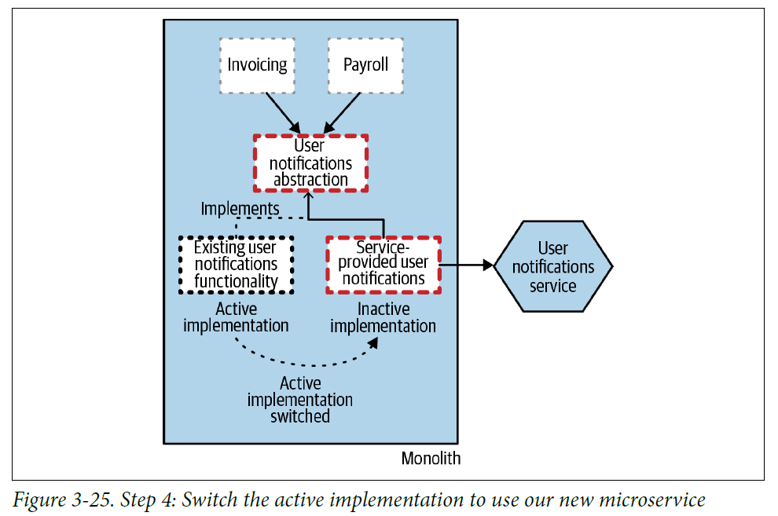
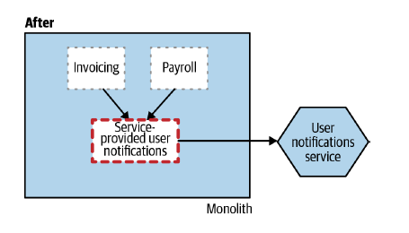

# **Branch By Abstraction** 
<div align="center">

[](https://github.com/MasterCloudApps-Projects/Monolith-to-Microservices-Examples/tree/master/Branch_By_Abstraction/README.md)
[](https://github.com/MasterCloudApps-Projects/Monolith-to-Microservices-Examples/tree/master/Branch_By_Abstraction/README.es.md)
</div>

Vamos a proceder a la realización y explicación del patrón ``Branch By Abstraction``, que se basa en permitir que dos implementaciones del mismo código coexistan en la misma versión, sin romper la funcionalidad.

Nos situamos en el caso de que necesitamos migrar un código interior del monolito el cuál recibe peticiones internas de otros servicios. Se aplica en múltiples pasos:
1. Crear una abstracción para reemplazar la funcionalidad.
2. Cambiar los clientes de la funcionalidad existente para utilizar la nueva abstracción.
3. Crear una nueva implementación de la abstracción que realice la petición a nuestro nuevo microservicio.
4. Cambiar la abstracción para usar nuestra nueva implementación.
5. Limpiar la abstracción y eliminar la implementación anterior.
6. (Opcional): Borrar la interfaz.

<br>

## **Ejemplo 1. Extracción de una funcionalidad dependiente**
____________________________________________________________
<div align="center">

[](https://www.youtube.com/watch?v=XcbroWk0JNM)
</div>

### **Paso 1**
Tenemos nuestra aplicación monolítica, las peticiones y funcionalidades se responden dentro del mismo.
```
docker-compose -f Example_1/1_docker-compose.yml up
```

Podemos probar nuestro monolito:
```
curl localhost:8080/inventory
```

Detenemos el paso 1:
```
docker stop example_1_step_1_branch_by_abstraction_monolith
```

### **Paso 2**
Vamos a aplicar el patrón para extraer la funcionalidad de `UserNotification` con los pasos explicados anteriormente.

1. Creamos la interfaz `UserNotificationService`.
2. Adaptamos la implementación de `UserNotificationService` (que pasa a llamarse `UserNotificationServiceImpl`) existente para utilizar la interfaz.
3. Creamos una nueva implementación de la interfaz, `UserNotificationServiceMSImpl`.
4. Introducimos `ff4j` que nos permite cambiar el uso de una u otra implementación en tiempo de ejecución `http://localhost:8080/ff4j-web-console`.

En este paso, vamos a llegar hasta el [``4``], nuestra aplicación se queda con el siguiente estado en el que podemos cambiar la implementación activa:

<div align="center">


</div>

Vamos a desplegar el ejemplo:
```
docker-compose -f Example_1/2_docker-compose.yml up
```
Tendremos una versión 2 del monolito y nuestro microservicio. Dentro de esta versión, podemos cambiar a usar o no el microservicio.

Hacemos una petición:
```
curl -v -H "Content-Type: application/json" -d '{"shipTo":"Juablaz", "total":320}' localhost:8080/payroll
```

Se loguea en el monolito:

```
example_1_step_2_branch_by_abstraction_monolith         | 2021-09-29 13:50:34.660  INFO 1 --- [io-8080-exec-10] e.c.m.b.s.i.UserNotificationServiceImpl  : Payroll 6 shipped to Juablaz of 320.0   
```

Si entramos en `http://localhost:8080/ff4j-web-console` y cambiamos el flag a habilitado, se realizará a través del microservicio.

Repetimos la petición:

```
curl -v -H "Content-Type: application/json" -d '{"shipTo":"Juablaz", "total":320}' localhost:8080/payroll
```

Se loguea en el microservicio:
```
example_1_step_2_branch_by_abstraction_notification_ms  | 2021-09-29 13:50:05.941  INFO 1 --- [nio-8081-exec-1] e.c.m.b.service.UserNotificationService  : Payroll 5 shipped to Juablaz of 320.0   
```

Detenemos el paso 2:
```
docker stop example_1_step_2_branch_by_abstraction_monolith
```

Como podemos observar, esta forma de gestionar los cambios y la migración al microservicio nos permite en caso de error activar/ desactivar el flag.
Incluso se podría combinar con los pasos aplicados en el ejemplo de `Strangler Fig`, lanzando las dos versiones convivientes y migrando las peticiones de uno a otro.

### **Paso 3**
5. Eliminaríamos el flag y la implementación antigua.

<div align="center">


</div>

6. (Opcional): Borrar la interfaz.

<div align="center">


</div>

Vamos a desplegar el ejemplo:

```
docker-compose -f Example_1/3_docker-compose.yml up
```

Hacemos una petición:
```
curl -v -H "Content-Type: application/json" -d '{"shipTo":"Juablaz","total":320}' localhost:8080/payroll
```

Vemos la respuesta:
```
example_1_step_3_branch_by_abstraction_notification_ms  | 2021-09-24 14:38:13.520  INFO 1 --- [nio-8081-exec-8] e.c.m.b.service.UserNotificationService  : Payroll 3 shipped to Juablaz of 320.0
```