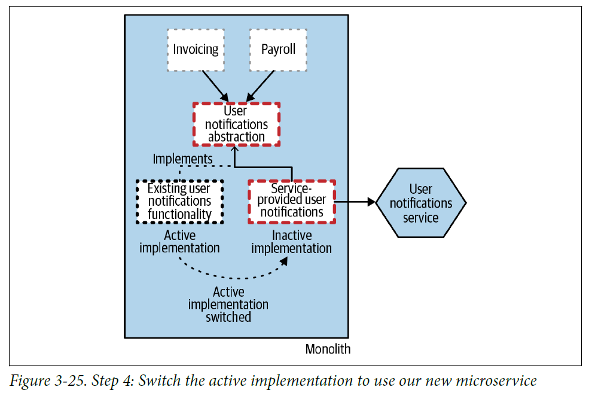
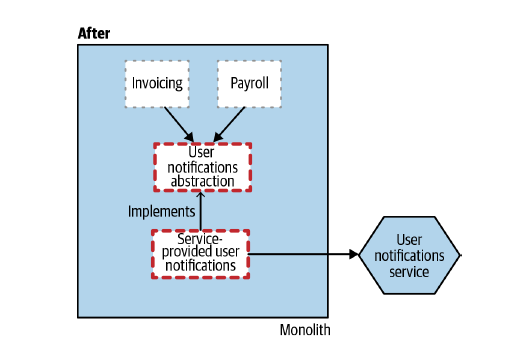

# **Branch By Abstraction** 
<div align="center">

[](https://github.com/MasterCloudApps-Projects/Monolith-to-Microservices-Examples/tree/master/Branch_By_Abstraction/README.md)
[](https://github.com/MasterCloudApps-Projects/Monolith-to-Microservices-Examples/tree/master/Branch_By_Abstraction/README.es.md)
</div>

We are going to proceed with the realization and explanation of the `Branch By Abstraction` pattern, which is based on allowing two implementations of the same code to coexist in the same version, without breaking the functionality.

We place ourselves in the case that we need to migrate an internal code of the monolith which receives internal requests from other services. It is applied in multiple steps:
1. Create an abstraction to replace the functionality.
2. Change existing functionality clients to use the new abstraction.
3. Create a new implementation of the abstraction that makes the request to our new microservice.
4. Change the abstraction to use our new implementation.
5. Clean up the abstraction and remove the old implementation.
6. (Optional): Delete the interface.

<br>

## **Example 1. Extraction of a dependent functionality**
___
### **Step 1**
We have our monolithic application, requests and functionalities are answered within it.
```
> docker-compose -f Example_1/1_docker-compose.yml up
```

We can test our monolith:
```
> curl localhost:8080/inventory
```

We stop step 1:
```
> docker-compose -f Example_1/1_docker-compose.yml down
```

### **Step 2**
We are going to apply the pattern to extract the functionality of `UserNotification` with the steps explained above.

1. We create the interface `UserNotificationService`.
2. We adapt the existing `UserNotificationService` implementation (renamed` UserNotificationServiceImpl`) to use the interface.
3. We create a new interface implementation, `UserNotificationServiceMSImpl`.
4. We introduce `ff4j` which allows us to change the use of one or another implementation at runtime` http: // localhost: 8080 / ff4j-web-console`.

In this step, we are going to get to [`4`], our application is left with the following state in which we can change the active implementation:

<div align="center">


</div>

We are going to display the example:
```
> docker-compose -f Example_1/2_docker-compose.yml up
```
We will have a version 2 of the monolith and our microservice. Within this version, we can change to use or not the microservice.

We make a request:
```
curl -v -H "Content-Type: application/json" -d '{"shipTo":"Juablaz","total":320}' localhost:8080/payroll
```

The monolith log:

```
example_1_step_2_branch_by_abstraction_monolith         | 2021-09-29 13:50:34.660  INFO 1 --- [io-8080-exec-10] e.c.m.b.s.i.UserNotificationServiceImpl  : Payroll 6 shipped to Juablaz of 320.0   
```

If we enter `http: // localhost: 8080 / ff4j-web-console` and change the flag to enabled, it will be done through the microservice.

We repeat the request:

```
curl -v -H "Content-Type: application/json" -d '{"shipTo":"Juablaz","total":320}' localhost:8080/payroll
```

Log in to the microservice:
```
example_1_step_2_branch_by_abstraction_notification_ms  | 2021-09-29 13:50:05.941  INFO 1 --- [nio-8081-exec-1] e.c.m.b.service.UserNotificationService  : Payroll 5 shipped to Juablaz of 320.0   
```

We stop step 2:
```
> docker-compose -f Example_1/2_docker-compose.yml down
```

As we can see, this way of managing changes and migration to the microservice allows us to activate / deactivate the flag in case of error.
It could even be combined with the steps applied in the example of `Strangler Fig`, launching the two coexisting versions and migrating the requests from one to the other.

### **Step 3**
5. We would remove the flag and the old implementation.

<div align="center">


</div>

6. (Optional): Delete the interface.

<div align="center">


</div>

We are going to display the example:

```
> docker-compose -f Example_1/3_docker-compose.yml up
```

We make a request:
```
> curl -v -H "Content-Type: application/json" -d '{"shipTo":"Juablaz","total":320}' localhost:8080/payroll
```

We see the answer:
```
example_1_step_3_branch_by_abstraction_notification_ms  | 2021-09-24 14:38:13.520  INFO 1 --- [nio-8081-exec-8] e.c.m.b.service.UserNotificationService  : Payroll 3 shipped to Juablaz of 320.0
```

We stop step 3:
```
> docker-compose -f Example_1/3_docker-compose.yml down
```