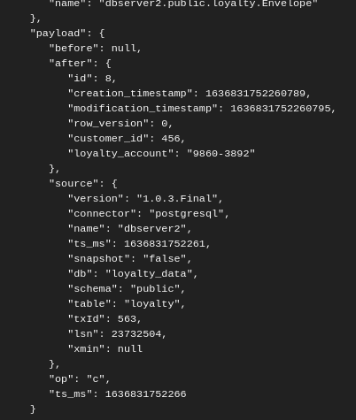

<h1 align="center"><b>Change Data Capture</b></h1></div>

<div align="center">

[](https://github.com/MasterCloudApps-Projects/Monolith-to-Microservices-Examples/tree/master/Change_Data_Capture/README.md)
[](https://github.com/MasterCloudApps-Projects/Monolith-to-Microservices-Examples/tree/master/Change_Data_Capture/README.es.md)
</div>


We will proceed to the realization and explanation of the `Change Data Capture` pattern. 
In this pattern, instead of trying to intercept and act on the calls made in the monolith, we react to the changes made in the database.

On this occasion we have posed a new statement. Our monolith when performing a user registration only responds to us that it was performed correctly. This makes the previous pattern `Decorating Collaborator` difficult to apply, we would have to make additional queries to the monolith that may not be exposed through an API.

<div align="center">


</div>

So in this case, we use the `Change Data Capture` pattern, detect the insertion in the `LoyaltyAccount` table and make a request to our microservice.

<div align="center">


</div>

<br>

## **Example 1. Transaction log pollers - Debezium**
____________________________________________________________

<div align="center">


</div>

Debezium is an open source distributed platform for Change Data Capture. The [Debezium documentation](https://debezium.io/documentation/reference/1.6/), is very well structured, and even has a tutorial on how to use it. For this example we are going to use the following structure:

- Postgres
- Kafka
  - Zookeeper.
  - Kafka Broker.
  - Kafka Connect with [Debezium](https://debezium.io/).
  - kafdrop For UI to Kafka topics.

First of all, we have created a startup script along with a docker-compose to help set up the example (we use version 1.4 or higher):
```bash
export DEBEZIUM_VERSION=1.4
```
Mount the docker using docker-compose. If this is the first time, it will take a moment.
```bash
docker-compose -f Example_1/1_docker-compose.yaml up --build
```
Configure the connectors with the DB. To simplify it, we have created a startup script.
```bash
sh Example_1/init.sh
```
To create the connector, we create a JSON with all the configuration. Which, by means of `./init.sh` we will start the variable that we will enter in the docker-compose:

```json
{
  "name": "pg_loyalty_data-connector",
  "config": {
    "connector.class": "io.debezium.connector.postgresql.PostgresConnector",
    "tasks.max": "1",
    "database.hostname": "postgres",
    "database.port": "5432",
    "database.user": "postgres",
    "database.password": "postgres",
    "database.server.id": "184055",
    "database.server.name": "dbserver2",
    "database.include": "loyalty_data",
    "database.dbname": "loyalty_data",
    "database.history.kafka.bootstrap.servers": "kafka:9092",
    "database.history.kafka.topic": "schema-changes.loyalty_data",
    "transforms": "route",
    "transforms.route.type": "org.apache.kafka.connect.transforms.RegexRouter",
    "transforms.route.regex": "([^.]+)\\.([^.]+)\\.([^.]+)",
    "transforms.route.replacement": "$3"
  }
}
```

Now that we have the database connected, we must make a change and see if it is reflected in `Debezium`. In the future, it would be to connect it together with `Elastic Search` or some connector system to see reflected those changes made in Postgres.

```
curl -v -H "Content-Type: application/json" -d '{"customerId":456,"loyaltyAccount":"9860-3892"}' localhost:8080/loyalty
```

Once in the KAFDROP we go to the `Loyalty` topic and there we will see all the messages related to the changes in our DB.

We have used Kafdrop as user interface. We can see a list of messages published in a topic. To open Kafdrop in local please click [here](http://localhost:9100/)

<div align="center">


</div>

The above screenshot shows the graphical interface of Kafdrop. A very intuitive view in which you can see all the ALCs and what interests us in our case, the TOPICS.

<div align="center">


</div>

Once we have the schematic structure, it is divided into two main parts:

```json
{
  "schema": {},
  "payload": {}
}

```
The schema object contains all the information about the structure of the change, from the schema (fields and types) of the affected row before and after the change, to the structure of other information that may be useful, such as the change operation, the connector or the modified row.
```json
{
  "schema": {
    "type":"struct",
    "fields": [
      {
        "type": "schema",
        "fields": [
          {
            "type": "string",
            "optional": false,
            "field": "field1"
          }
          (...)
        ],
        "optional": true,
        "name": "dbserver.table1.database1.Value",
        "field": "before"
      },
      (...)
    ],    
    (...)
  }
}
```
The payload object contains all the information about the values of the change. This object is the most commonly exploited in the use cases that consume this information, since it contains all the information about the values of the row before the change, the values after the change, the operation that has been performed and the complementary information of both the connector and the change itself.

<div align="center">


</div>

As you can see, being an `op: c` that is to say a `Create` the object before is `null` and the one after is the created object.
```json
"payload": {
  "before": null,
  "after": {
    "field1": "test",
    "field2": 0.1
  },
  "source": {},
  "op": "c",
  "ts_ms": 1618681673399,
  "transaction": null
}

```
As you can see, being an `op: c` that is to say a `Create` the object before is `null` and the one after is the created object.

https://www.paradigmadigital.com/dev/vistazo-debezium-herramienta-change-data-capture/

<br>

## **Example 2. Batch delta copier** 
______
<div align="center">

[](https://www.youtube.com/watch?v=f2Mr2f-VIGU)
</div>

Probably this is the most simplistic approach, we write a program that periodically scans the database to see what data has changed and copies it to the destination.

The main problem is to find out what data has actually changed. Schema design can complicate this task. 

For this example, we added timestamps, but this added significant work and a change data capture system as previous one would handle this problem much more easy.

We have also used: https://www.baeldung.com/jpa-optimistic-locking 

We have an abstract class, and every entity must extend this one.

```java
@Data
@EqualsAndHashCode(callSuper = false)
@MappedSuperclass
public abstract class EntityBase<I> {

  @JsonProperty("rowVersion")
  @Column(name = "row_version")
  @Version
  Integer version = 0;

  @Column(updatable = false)
  @JsonFormat(shape = JsonFormat.Shape.STRING)
  @CreationTimestamp
  private LocalDateTime creationTimestamp;

  @JsonFormat(shape = JsonFormat.Shape.STRING)
  @UpdateTimestamp
  private LocalDateTime modificationTimestamp;

  public abstract I getId();

}
```

### **Step 1**
We start from our monolithic application that creates user fidelities.
```
docker-compose -f Example_2/1_docker-compose-monolith.yml up 
```
```
docker-compose -f Example_2/1_docker-compose-proxy.yml up -d
```

We test that everything works correctly:

```
curl -v -H "Content-Type: application/json" -d '{"customerId":456, "loyaltyAccount": "9860-3892"}' payment.service/loyalty
```

### **Step 2**
In this step, we have our microservice that needs the information we inserted in the monolith.
Periodically we scan the database to see what data has changed and copy it to the target.
We use two properties to identify the day's changes:
- ``creationTimestamp``.
- ``modificationTimestamp``.


```
docker-compose -f Example_2/2_docker-compose.yml up 
```

With everything deployed, let's run our batch manually and test if the data is in our microservice:

We have enabled an option so we can run it manually:

```
curl -v http://localhost:8083/loyalty/migration
```

Let's see if the data is found:
```
curl -v http://localhost:8081/loyalty
```

The day's data is returned.

### **Step 3**
We can at this point consider dropping the monolith and using the microservice functionality exclusively.

<br>

## **Example 3. DB Triggers**

Available in future versions...


<!-- 
<div align="center">


</div>
MYSQL
https://stackoverflow.com/questions/40470267/calling-a-rest-api-from-a-trigger-or-stored-procedure-in-mysql

https://hub.docker.com/r/sergiimazurok/mysql-udf-http


POSTGRESQL

https://hub.docker.com/r/ycheung/postgresql-http

https://docs.spring.io/spring-data/jpa/docs/1.9.4.RELEASE/reference/html/#jpa.stored-procedures

```
docker-compose -f Example_1/1_docker-compose-monolith.yml up 

docker-compose -f Example_1/1_docker-compose-proxy.yml up -d
```

```
curl -v -H "Content-Type: application/json" -d '{"customerId":456,"loyaltyAccount":"9860-3892"}' payment.service/loyalty
```

curl -v payment.service/loyalty/1

docker run --name my-postgres-plperl-server -p 5432:5432 -e POSTGRES_DB=loyalty-db -e POSTGRES_PASSWORD=password -d ycheung/postgresql-http

docker exec -it 23f7c67c46c0 bash

psql -U postgres


\c loyalty-db;


docker run --name postgres-monolith-database -p 5432:5432 -e POSTGRES_PASSWORD=password -e POSTGRES_DB=monolith-db -e POSTGRES_USER=user -d postgres


docker run --name postgres-ms-database -p 5433:5432 -e POSTGRES_PASSWORD=password -e POSTGRES_DB=ms-db -e POSTGRES_USER=user -d postgres


loyalty-db=# select proname,prosrc from pg_proc where proname='restful_post'; 

INSERT INTO loyalty(id, customer_id, loyalty_account) VALUES (1000, 123, 'loyalty-1234');

SELECT content::json->>'form'
FROM http_post('http://payment.service/loyalty/printer',
                'myvar=myval&foo=bar',
                'application/x-www-form-urlencoded');
