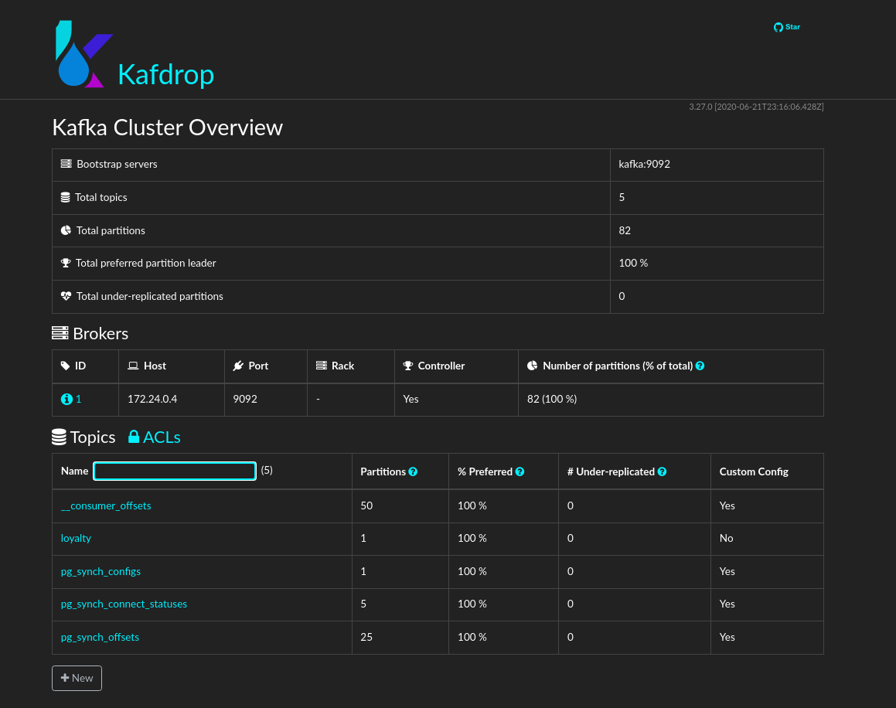
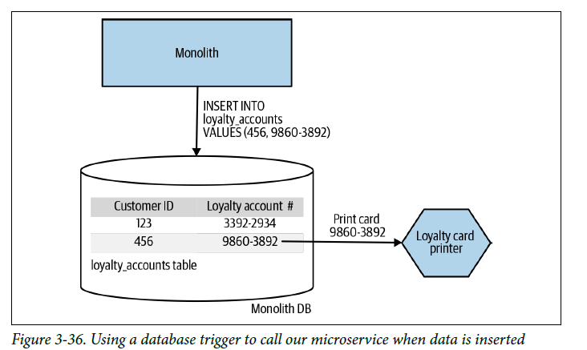

# **Change Data Capture**

<div align="center">

[](https://github.com/MasterCloudApps-Projects/Monolith-to-Microservices-Examples/tree/master/Change_Data_Capture/README.md)
[](https://github.com/MasterCloudApps-Projects/Monolith-to-Microservices-Examples/tree/master/Change_Data_Capture/README.es.md)
</div>


Vamos a proceder a la realización y explicación del patrón `Change Data Capture`. 
En este patrón, en lugar de intentar interceptar y actuar en las llamadas realizadas en el monolito, reaccionamos a los cambios realizados en la base de datos.

En esta ocasión hemos planteado un nuevo enunciado. Nuestro monolito al realizar una inscripción de un usuario sólo nos responde que se realizó correctamente. Esto provoca que realizar el patrón anterior `Decorating Collaborator` sea difícil de aplicar, tendríamos que hacer consultas adicionales al monolito que puede que no estén expuestas a través de una API.

<div align="center">


</div>

Por lo que en este caso, utilizamos el patrón `Change Data Capture`, detectamos la inserción en la tabla de `LoyaltyAccount` y hacemos una petición a nuestro microservicio.

<div align="center">


</div>

<br>

## **Ejemplo 1. Transaction log pollers - Debezium**
____________________________________________________________

<div align="center">


</div>

Debezium es una plataforma distribuida open source para Change Data Capture. La [documentación de Debezium](https://debezium.io/documentation/reference/1.6/), esta muy bien estructurada, y posee hasta un tutorial de utilización. Nosotros para este ejemplo vamos a utilizar la siguiente estructura:

- Postgres
- Kafka
  - Zookeeper.
  - Kafka Broker.
  - Kafka Connect with [Debezium](https://debezium.io/).
  - kafdrop For UI to Kafka topics.

Primero de todo, hemos creado un script de inicio junto a un docker-compose para ayudar a montar el ejemplo:
```bash
export DEBEZIUM_VERSION=1.4 (or latest)

# Monta los docker utilizando docker-compose. Si es la primera vez, tardara un momento.

docker-compose -f Example_1/1_docker-compose.yaml up --build

# Configura los conectores con la DB. Para simplificarlo, hemos creado un script de inicio. 

sh Example_1/init.sh
```

Para crear el conector, creamos un JSON con toda la configuracion. La cual, mediante el `./init.sh` iniciaremos la variable que ingresaremos en el docker-compose:

```json
{
  "name": "pg_loyalty_data-connector",
  "config": {
    "connector.class": "io.debezium.connector.postgresql.PostgresConnector",
    "tasks.max": "1",
    "database.hostname": "postgres",
    "database.port": "5432",
    "database.user": "postgres",
    "database.password": "postgres",
    "database.server.id": "184055",
    "database.server.name": "dbserver2",
    "database.include": "loyalty_data",
    "database.dbname": "loyalty_data",
    "database.history.kafka.bootstrap.servers": "kafka:9092",
    "database.history.kafka.topic": "schema-changes.loyalty_data",
    "transforms": "route",
    "transforms.route.type": "org.apache.kafka.connect.transforms.RegexRouter",
    "transforms.route.regex": "([^.]+)\\.([^.]+)\\.([^.]+)",
    "transforms.route.replacement": "$3"
  }
}
```

Ahora que tenemos la BBDD conectada, debemos realizar un cambio y ver si se refleja en `Debezium`. A futuro, seria conectarlo junto a `Elastic Search` o algun sistema conector para ver reflejados dichos cambios realizados en Postgres.

```
curl -v -H "Content-Type: application/json" -d '{"customerId":456,"loyaltyAccount":"9860-3892"}' localhost:8080/loyalty
```

Una vez en el KAFDROP nos metemos al topic `Loyalty` y ahi nos apareceran todos los mensajes referentes a los cambios en nuestra BBDD.

Hemos utilizado Kafdrop como interfaz de usuario. Podemos ver una lista de mensajes publicados en un tema. Para abrir Kafdrop en local por favor haga clic [aquí](http://localhost:9100/)

<div align="center">


</div>

La captura de pantalla anterior, muestra la interfaz grafica de Kafdrop. Una vista muy intuitiva en la que se ven todos los ALCs y lo que nos interesa en nuestro caso, los TOPICS.

<div align="center">


</div>

Una vez tenemos la estrustura del esquema, esta dividido en dos partes principales:
```json
{
  "schema": {},
  "payload": {}
}

```
El objeto schema contiene toda la información sobre la estructura del cambio, desde el esquema (campos y tipos) de la fila afectada antes y después del cambio, hasta la estructura de otro tipo de información que puede ser útil, como la operación de cambio, el conector o la fila modificada.
```json
{
  "schema": {
    "type":"struct",
    "fields": [
      {
        "type": "schema",
        "fields": [
          {
            "type": "string",
            "optional": false,
            "field": "field1"
          }
          (...)
        ],
        "optional": true,
        "name": "dbserver.table1.database1.Value",
        "field": "before"
      },
      (...)
    ],    
    (...)
  }
}
```
El objeto payload contiene toda la información sobre los valores del cambio. Este objeto es el que más se suele explotar en los casos de uso que consumen esta información, ya que contiene toda la información de los valores de la fila anteriores al cambio, los posteriores al cambio, la operación que se ha realizado y la información complementaria tanto del conector como del propio cambio.

<div align="center">


</div>

Como veis, al ser un `op: c` osea un `Create` el objeto de antes es `null` y el de despues el objeto creado.
```json
"payload": {
  "before": null,
  "after": {
    "field1": "test",
    "field2": 0.1
  },
  "source": {},
  "op": "c",
  "ts_ms": 1618681673399,
  "transaction": null
}

```
Un objeto complementa al otro y viceversa, lo que proporciona un gran detalle del cambio que se ha producido.

https://www.paradigmadigital.com/dev/vistazo-debezium-herramienta-change-data-capture/

<br>

## **Example 2. Batch delta copier** 
______
<div align="center">

[](https://www.youtube.com/watch?v=EX93LwF6zBs)
</div>

Probably this is the most simplistic approach, we write a program that periodically scans the database to see what data has changed and copies it to the destination.

The main problem is to find out what data has actually changed. Schema design can complicate this task. 

For this example, we added timestamps, but this added significant work and a change data capture system as previous one would handle this problem much more easy.

We have also used: https://www.baeldung.com/jpa-optimistic-locking 

We have an abstract class, and every entity must extend this one.

```java
@Data
@EqualsAndHashCode(callSuper = false)
@MappedSuperclass
public abstract class EntityBase<I> {

  @JsonProperty("rowVersion")
  @Column(name = "row_version")
  @Version
  Integer version = 0;

  @Column(updatable = false)
  @JsonFormat(shape = JsonFormat.Shape.STRING)
  @CreationTimestamp
  private LocalDateTime creationTimestamp;

  @JsonFormat(shape = JsonFormat.Shape.STRING)
  @UpdateTimestamp
  private LocalDateTime modificationTimestamp;

  public abstract I getId();

}
```

### **Step 1**
We start from our monolithic application that creates user fidelities.
```
docker-compose -f Example_2/1_docker-compose-monolith.yml up 
```
```
docker-compose -f Example_2/1_docker-compose-proxy.yml up -d
```

We test that everything works correctly:

```
curl -v -H "Content-Type: application/json" -d '{"customerId":456, "loyaltyAccount": "9860-3892"}' payment.service/loyalty
```

### **Step 2**
In this step, we have our microservice that needs the information we inserted in the monolith.
Periodically we scan the database to see what data has changed and copy it to the target.
We use two properties to identify the day's changes:
- ``creationTimestamp``.
- ``modificationTimestamp``.


```
docker-compose -f Example_2/2_docker-compose.yml up 
```

With everything deployed, let's run our batch manually and test if the data is in our microservice:

We have enabled an option so we can run it manually:

```
curl -v http://localhost:8083/loyalty/migration
```

Let's see if the data is found:
```
curl -v http://localhost:8081/loyalty
```

The day's data is returned.

### **Step 3**
We can at this point consider dropping the monolith and using the microservice functionality exclusively.

<br>

## **Example 3. DB Triggers**

Available in future versions...


<!-- 
<div align="center">


</div>
MYSQL
https://stackoverflow.com/questions/40470267/calling-a-rest-api-from-a-trigger-or-stored-procedure-in-mysql

https://hub.docker.com/r/sergiimazurok/mysql-udf-http


POSTGRESQL

https://hub.docker.com/r/ycheung/postgresql-http

https://docs.spring.io/spring-data/jpa/docs/1.9.4.RELEASE/reference/html/#jpa.stored-procedures

```
docker-compose -f Example_1/1_docker-compose-monolith.yml up 

docker-compose -f Example_1/1_docker-compose-proxy.yml up -d
```

```
curl -v -H "Content-Type: application/json" -d '{"customerId":456,"loyaltyAccount":"9860-3892"}' payment.service/loyalty
```

curl -v payment.service/loyalty/1

docker run --name my-postgres-plperl-server -p 5432:5432 -e POSTGRES_DB=loyalty-db -e POSTGRES_PASSWORD=password -d ycheung/postgresql-http

docker exec -it 23f7c67c46c0 bash

psql -U postgres


\c loyalty-db;


docker run --name postgres-monolith-database -p 5432:5432 -e POSTGRES_PASSWORD=password -e POSTGRES_DB=monolith-db -e POSTGRES_USER=user -d postgres


docker run --name postgres-ms-database -p 5433:5432 -e POSTGRES_PASSWORD=password -e POSTGRES_DB=ms-db -e POSTGRES_USER=user -d postgres


loyalty-db=# select proname,prosrc from pg_proc where proname='restful_post'; 

INSERT INTO loyalty(id, customer_id, loyalty_account) VALUES (1000, 123, 'loyalty-1234');

SELECT content::json->>'form'
FROM http_post('http://payment.service/loyalty/printer',
                'myvar=myval&foo=bar',
                'application/x-www-form-urlencoded');
