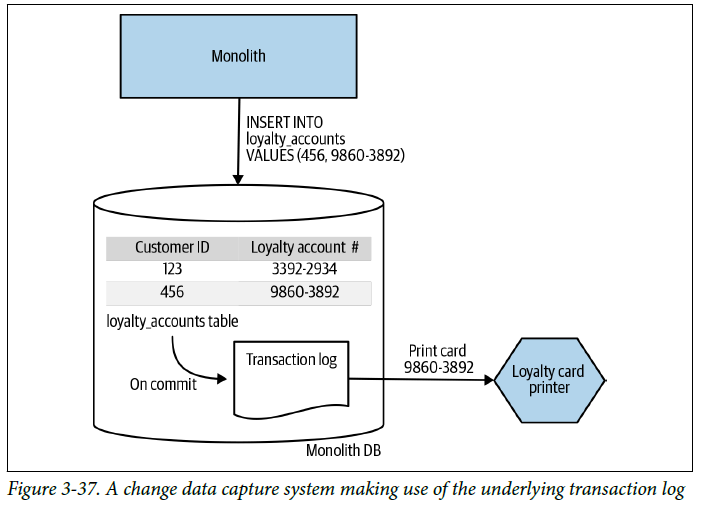

# Change Data Capture

Vamos a proceder a la realización y explicación del patrón ``Change Data Capture``. 
En este patrón, en lugar de intentar interceptar y actuar en las llamadas realizadas en el monolito, reaccionamos a los cambios realizados en la base de datos.

En esta ocasión hemos planteado un nuevo enunciado. Nuestro monolito al realizar una inscripción de un usuario sólo nos responde que se realizó correctamente. Esto provoca que realizar el patrón anterior ``Decorating Collaborator`` sea difícil de aplicar, tendríamos que hacer consultas adicionales al monolito que puede que no estén expuestas a través de una API.


Por lo que en este caso, utilizamos el patrón ``Change Data Capture``, detectamos la inserción en la tabla de ``LoyaltyAccount`` y hacemos una petición a nuestro microservicio.


## **Ejemplo 1. Triggers de BBDD**


MYSQL
https://stackoverflow.com/questions/40470267/calling-a-rest-api-from-a-trigger-or-stored-procedure-in-mysql

https://hub.docker.com/r/sergiimazurok/mysql-udf-http


POSTGRESQL

https://hub.docker.com/r/ycheung/postgresql-http

https://docs.spring.io/spring-data/jpa/docs/1.9.4.RELEASE/reference/html/#jpa.stored-procedures

```
> docker-compose -f Ejemplo_1/1_docker-compose-monolith.yml up 

> docker-compose -f Ejemplo_1/1_docker-compose-proxy.yml up -d
```

```
> curl -v -H "Content-Type: application/json" -d '{"customerId":456,"loyaltyAccount":"9860-3892"}' payment.service/loyalty
```

curl -v payment.service/loyalty/1

docker run --name my-postgres-plperl-server -p 5432:5432 -e POSTGRES_DB=loyalty-db -e POSTGRES_PASSWORD=password -d ycheung/postgresql-http

docker exec -it 23f7c67c46c0 bash

psql -U postgres


\c loyalty-db;


docker run --name postgres-monolith-database -p 5432:5432 -e POSTGRES_PASSWORD=password -e POSTGRES_DB=monolith-db -e POSTGRES_USER=user -d postgres


docker run --name postgres-ms-database -p 5433:5432 -e POSTGRES_PASSWORD=password -e POSTGRES_DB=ms-db -e POSTGRES_USER=user -d postgres


loyalty-db=# select proname,prosrc from pg_proc where proname='restful_post'; 

INSERT INTO loyalty(id, customer_id, loyalty_account) VALUES (1000, 123, 'loyalty-1234');

SELECT content::json->>'form'
FROM http_post('http://payment.service/loyalty/printer',
                'myvar=myval&foo=bar',
                'application/x-www-form-urlencoded');


## **Ejemplo 2. Transaction log pollers**



## **Ejemplo 3. Batch delta copier**
Probablemente el enfoque más simplista es escribir un programa que de forma periódica se escanee la base de datos para ver qué datos han cambiado y se copien en el destino.

El principal problema es averiguar qué datos han cambiado realmente. El diseño del esquema puede complicar mucho esta tarea. 

Podría comenzar a agregar estas marcas de tiempo usted mismo, pero esto podría agregar un trabajo significativo, y un sistema de captura de datos de cambios manejaría este problema de manera mucho más elegante.

https://www.baeldung.com/jpa-optimistic-locking


### **Paso 1**
Partimos de nuestra aplicación monolítica que crea fidelizaciones del usuario.
```
> docker-compose -f Ejemplo_3/1_docker-compose-monolith.yml up 

> docker-compose -f Ejemplo_3/1_docker-compose-proxy.yml up -d
```

Probamos que todo funciona correctamente:

```
> curl -v -H "Content-Type: application/json" -d '{"customerId":456,"loyaltyAccount":"9860-3892"}' payment.service/loyalty
```

### **Paso 2**
En este paso, tenemos nuestro microservicio que necesita de la información que insertamos en el monolito.
Periódicamente se escanea la base de datos para ver qué datos han cambiado y se copien en el destino.
Utilizamos dos propiedades para identificar los cambios del día:
- ``creationTimestamp``
- ``modificationTimestamp``


```
> docker-compose -f Ejemplo_3/2_docker-compose.yml up 
```

Con todo desplegado, vamos a ejecutar nuestro batch de forma manual y probemos si están los datos en nuestro microservicio:

Hemos habilitado una opción para que podamos ejecutarlo de forma manual:

```
> curl -v  http://localhost:8083/loyalty/migration
```

Veamos si se encuentran los datos:
```
> curl -v  http://localhost:8081/loyalty
```

Se devuelven los datos del día.

### **Paso 3**
Podemos en este punto plantearnos dejar de utilizar el monolito y usar exclusivamente la funcionalidad del microservicio.


## **Ejemplo 4. Debezium**
Debezium es una plataforma distribuida open source para Change Data Capture. La [documentación de Debezium](https://debezium.io/documentation/reference/1.6/), esta muy bien estructurada, y posee hasta un tutorial de utilización. Nosotros para este ejemplo vamos a utilizar la siguiente estructura:

- Postgres
- Kafka
  - Zookeeper.
  - Kafka Broker.
  - Kafka Connect with [Debezium](https://debezium.io/).
  - kafdrop For UI to Kafka topics.

Primero de todo, hemos creado un script de inicio junto a un docker-compose para ayudar a montar el ejemplo:
```
export DEBEZIUM_VERSION=1.4 (or latest)

# Monta los docker utilizando docker-compose. Si es la primera vez, tardara un momento.

docker-compose -f Ejemplo_4/1_docker-compose.yml up --build

# Configura los conectores con la DB. Para simplificarlo, hemos creado un script de inicio. 

./init.sh
```

Para crear el conector, creamos un JSON con toda la configuracion. La cual, mediante el `./init.sh` iniciaremos la variable que ingresaremos en el docker-compose:

```
{
  "name": "pg_loyalty_data-connector",
  "config": {
    "connector.class": "io.debezium.connector.postgresql.PostgresConnector",
    "tasks.max": "1",
    "database.hostname": "postgres",
    "database.port": "5432",
    "database.user": "postgres",
    "database.password": "postgres",
    "database.server.id": "184055",
    "database.server.name": "dbserver2",
    "database.include": "loyalty_data",
    "database.dbname": "loyalty_data",
    "database.history.kafka.bootstrap.servers": "kafka:9092",
    "database.history.kafka.topic": "schema-changes.loyalty_data",
    "transforms": "route",
    "transforms.route.type": "org.apache.kafka.connect.transforms.RegexRouter",
    "transforms.route.regex": "([^.]+)\\.([^.]+)\\.([^.]+)",
    "transforms.route.replacement": "$3"
  }
}
```

Ahora que tenemos la BBDD conectada, debemos realizar un cambio y ver si se refleja en `Debezium`. A futuro, seria conectarlo junto a `Elastic Search` o algun sistema conector para ver reflejados dichos cambios realizados en Postgres.

TODO: Evitar hacer los cambios manuales en la BBDD, meter un script o algo

Hemos utilizado Kafdrop como interfaz de usuario. Podemos ver una lista de mensajes publicados en un tema. Para abrir Kafdrop en local por favor haga clic [aquí](http://localhost:9100/)

TODO: Poner pantallazos y explicacion de la devolucion del mensaje del connector debezium kafka.

https://www.paradigmadigital.com/dev/primeros-pasos-con-debezium/


