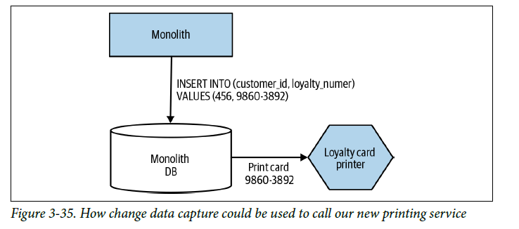

# Change Data Capture

Vamos a proceder a la realización y explicación del patrón ``Change Data Capture``. 
En este patrón, en lugar de intentar interceptar y actuar en las llamadas realizadas en el monolito, reaccionamos a los cambios realizados en la base de datos.

En esta ocasión hemos planteado un nuevo enunciado. Nuestro monolito al realizar una inscripción de un usuario sólo nos responde que se realizó correctamente. Esto provoca que realizar el patrón anterior ``Decorating Collaborator`` sea difícil de aplicar, tendríamos que hacer consultas adicionales al monolito que puede que no estén expuestas a través de una API.


Por lo que en este caso, utilizamos el patrón ``Change Data Capture``, detectamos la inserción en la tabla de ``LoyaltyAccount`` y hacemos una petición a nuestro microservicio.



## **Ejemplo 1. Triggers de BBDD**


MYSQL
https://stackoverflow.com/questions/40470267/calling-a-rest-api-from-a-trigger-or-stored-procedure-in-mysql

https://hub.docker.com/r/sergiimazurok/mysql-udf-http


POSTGRESQL
https://stackoverflow.com/questions/46540352/calling-restful-web-services-from-postgresql-procedure-function

https://hub.docker.com/r/garethflowers/postgres-plperl-server

https://docs.spring.io/spring-data/jpa/docs/1.9.4.RELEASE/reference/html/#jpa.stored-procedures

```
> docker-compose -f Ejemplo_1/1_docker-compose-monolith.yml up 

> docker-compose -f Ejemplo_1/1_docker-compose-proxy.yml up -d
```

```
> curl -v -H "Content-Type: application/json" -d '{"customerId":456,"loyaltyAccount":"9860-3892"}' payment.service/loyalty
```

curl -v payment.service/loyalty/1


## **Ejemplo 2. Transaction log pollers**


## **Ejemplo 3. Batch delta copier**
Probablemente el enfoque más simplista es escribir un programa que de forma periódica se escanee la base de datos para ver qué datos han cambiado y se copien en el destino.

El principal problema es averiguar qué datos han cambiado realmente. El diseño del esquema puede complicar mucho esta tarea. 

Podría comenzar a agregar estas marcas de tiempo usted mismo, pero esto podría agregar un trabajo significativo, y un sistema de captura de datos de cambios manejaría este problema de manera mucho más elegante.
(DEBEZIUM)
https://www.paradigmadigital.com/dev/primeros-pasos-con-debezium/


