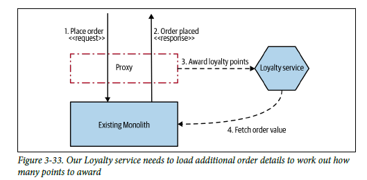

# Decorating Collaborator

Vamos a proceder a la realización y explicación del patrón ``Decorating Collaborator``. Este patrón se basa en la aplicación de un proxy en el caso de no poder tocar el microservicio. Dicho proxy deberá capturar las respuestas a  las peticiones necesarias para migrarlas al nuevo microservicio que podrá hacer uso o no de información que debe exponer el monolito.

## **Ejemplo 1. Nueva funcionalidad**
En esta ocasión hemos planteado un nuevo enunciado.

