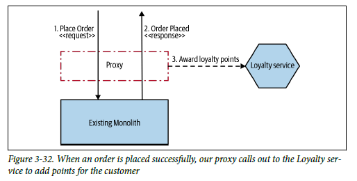
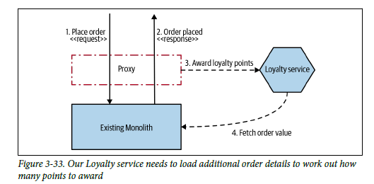

# **Decorating Collaborator**
<div align="center">

[](https://github.com/MasterCloudApps-Projects/Monolith-to-Microservices-Examples/tree/master/Decorating_Collaborator/README.md)
[](https://github.com/MasterCloudApps-Projects/Monolith-to-Microservices-Examples/tree/master/Decorating_Collaborator/README.es.md)
</div>

Vamos a proceder a la realización y explicación del patrón `Decorating Collaborator`. Este patrón se basa en la aplicación de un proxy para una vez llegue la respuesta del monolito hacer una operación en un nuevo microservicio. Este microservicio podrá hacer uso o no de información que debe exponer el monolito.

## **Ejemplo 1. Nueva funcionalidad**
____

En esta ocasión hemos planteado un nuevo enunciado.
<div align="center">


</div>

### **Paso 1**

Tenemos nuestra aplicación monolítica, las peticiones y funcionalidades se responden dentro del mismo.

```
docker-compose -f Example_1/1_docker-compose-monolith.yml up
```
```
docker-compose -f Example_1/1_docker-compose-proxy.yml up -d
```

La configuración del proxy:
```
server {
  listen 80;
  server_name payment.service;

  location ~ ^/ {
    proxy_pass http://1-decorating-collaborator-monolith:8080;
  }
}
```

Podemos probar nuestro monolito:
```
curl -v -H "Content-Type: application/json" -d '{"userName":"Juablaz", "prize":250, "description":"Monitor"}' payment.service/order
```

### **Paso 2**
Debemos implementar la funcionalidad en un nuevo microservicio que basado en una respuesta correcta de la creación de `Order` deberá añadir puntos a un usuario en el microservicio de `Loyalty`.

Lanzamos una versión del microservicio y un `Gateway` realizado con spring cloud `Gateway`.

```
docker-compose -f Example_1/2_docker-compose.yml up 
```

Definimos un enrutador, de esta forma las peticiones de `Order` irán al monolito y las de `Loyalty` irán al microservicio, podremos acceder a cada uno de ellos a través de un punto común.

```java
@Bean
public RouteLocator hostRoutes(RouteLocatorBuilder builder) {
  return builder.routes()
      .route(r -> r.path("/order/**")
          .filters(f -> f.rewritePath("/order/(?<segment>.*)", "/order/${segment}"))
          .uri("http://" + ORDER_HOST + ":" + ORDER_PORT))
      .route(r -> r.path("/loyalty/**")
          .filters(f -> f
              .rewritePath("/loyalty/(?<segment>.*)", "/loyalty/${segment}"))
          .uri("http://" + LOYALTY_HOST + ":" + LOYALTY_PORT))
      .build();
}
```

Además, en el caso de tratarse de una petición `POST` al endpoint de `/order` se ejecutará `addLoyaltyDetails`, que permite una vez terminada la petición de creación correcta de una `Order`, realizar una petición al microservicio de `Loyalty`

```java
@Bean
public RouterFunction<ServerResponse> orderHandlerRouting(OrderHandlers orderHandlers) {
  return RouterFunctions.route(POST("/order"), orderHandlers::addLoyaltyDetails);
}
```

```java
public Mono<ServerResponse> addLoyaltyDetails(ServerRequest serverRequest) {

  Mono<OrderInfo> orderInfoMono = serverRequest.bodyToMono(OrderInfo.class);

  Mono<OrderInfo> orderInfo = orderService.createOrder(orderInfoMono);

  return orderInfo
      .zipWhen(orderInfo1 -> loyaltyService.createOrUpdate(orderInfo1.getUserName()))
      .flatMap(orderDetails -> ServerResponse.ok().contentType(MediaType.APPLICATION_JSON)
          .body(fromValue(orderDetails.getT1())))
      .onErrorResume(EntityNotFoundException.class, e -> ServerResponse.notFound().build());
}
```

Probemos nuestro microservicio:

```
curl -v -H "Content-Type: application/json" -d '' localhost:8081/loyalty/Juablaz
```

Probemos nuestro `Gateway`:

```
curl -v -H "Content-Type: application/json" -d '{"userName":"Juablaz2","prize":250, "description":"Monitor"}' localhost:8082/order
```
```
curl localhost:8082/loyalty/Juablaz2
```

Se crea el usuario en el microservicio nuevo y se le añaden 10 puntos:
```
{"id":3,"userName":"Juablaz2","points":10.0}
```

### **Paso 3**
Una vez probado el gateway, movamos las peticiones desde nuestro proxy de `nginx` a nuestro gateway.

```
docker-compose -f Example_1/3_docker-compose-proxy.yml up -d
```

La nueva configuración del proxy:
```
server {
  listen 80;
  server_name payment.service;

  location ~ ^/ {
    proxy_pass http://2-decorating-collaborator-gateway-ms:8082;
  }
}
```

```
curl -v -H "Content-Type: application/json" -d '{"userName":"Juablaz", "prize":250, "description":"Monitor"}' payment.service/order
```
```
curl payment.service/loyalty/Juablaz
```

Es posible incluso que sea necesario recuperar más información del monolito, en ese caso tendríamos que exponer un endpoint en el monolito y realizar la 
petición desde el microservicio.

<div align="center">


</div>

Esto podría generar una carga adicional, además introduce una dependencia circular, podría ser mejor cambiar el monolito para proporcionar la información requerida cuando se complete nuestra petición de crear un pedido. Sin embargo, esto requeriría cambiar el código del monolito o quizás usar otro patrón, que estudiaremos a continuación `Change Data Capture`.
