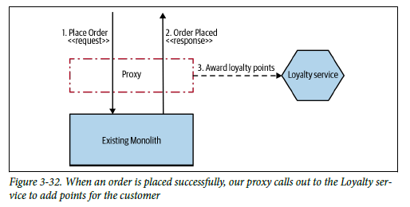
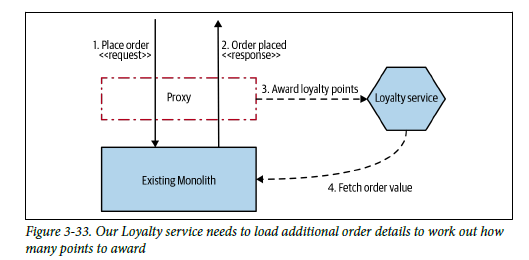

# **Decorating Collaborator**
<div align="center">

[](https://github.com/MasterCloudApps-Projects/Monolith-to-Microservices-Examples/tree/master/Decorating_Collaborator/README.md)
[](https://github.com/MasterCloudApps-Projects/Monolith-to-Microservices-Examples/tree/master/Decorating_Collaborator/README.es.md)
</div>

We are going to proceed to the realization and explanation of the `Decorating Collaborator` pattern. This pattern is based on the application of a proxy to perform an operation in a new microservice once the response from the monolith arrives. This microservice may or may not make use of information to be exposed by the monolith.

## **Example 1. New functionality**
____

This time we have raised a new statement.
<div align="center">


</div>

### **Step 1**

We have our monolithic application, requests and functionalities are answered within it.

```
> docker-compose -f Example_1/1_docker-compose-monolith.yml up

> docker-compose -f Example_1/1_docker-compose-proxy.yml up -d
```

We can test our monolith:
```
> curl -v -H "Content-Type: application/json" -d '{"userName":"Juablaz", "prize":250, "description":"Monitor"}' payment.service/order
```

### **Step 2**
We must implement the functionality in a new microservice that based on a successful response from the creation of `Order` should add points to a user in the `Loyalty` microservice.

We launch a version of the microservice and a `Gateway` made with spring cloud `Gateway`.

```
> docker-compose -f Example_1/2_docker-compose.yml up 
```

We define a router, this way the `Order` requests will go to the monolith and the `Loyalty` requests will go to the microservice, we will be able to access each of them through a common point.

```java
@Bean
public RouteLocator hostRoutes(RouteLocatorBuilder builder) {
  return builder.routes()
      .route(r -> r.path("/order/**")
          .filters(f -> f.rewritePath("/order/(?<segment>.*)", "/order/${segment}"))
          .uri("http://" + ORDER_HOST + ":" + ORDER_PORT))
      .route(r -> r.path("/loyalty/**")
          .filters(f -> f
              .rewritePath("/loyalty/(?<segment>.*)", "/loyalty/${segment}")))
          .uri("http://" + LOYALTY_HOST + ":" + LOYALTY_PORT))
      .build();
}
```

In addition, in the case of a `POST` request to the `/order` endpoint, `addLoyaltyDetails` will be executed, which allows a request to be made to the `Loyalty` microservice once the request for the successful creation of an `Order` has been completed.

```java
@Bean
public RouterFunction<ServerResponse> orderHandlerRouting(OrderHandlers orderHandlers) {
  return RouterFunctions.route(POST("/order"), orderHandlers::addLoyaltyDetails);
}
```

```java
public Mono<ServerResponse> addLoyaltyDetails(ServerRequest serverRequest) {

  Mono<OrderInfo> orderInfoMono = serverRequest.bodyToMono(OrderInfo.class);

  Mono<OrderInfo> orderInfo = orderService.createOrder(orderInfoMono);

  return orderInfo
      .zipWhen(orderInfo1 -> loyaltyService.createOrUpdate(orderInfo1.getUserName())))
      .flatMap(orderDetails -> ServerResponse.ok().contentType(MediaType.APPLICATION_JSON)
          .body(fromValue(orderDetails.getT1())))
      .onErrorResume(EntityNotFoundException.class, e -> ServerResponse.notFound().build()));
}
```

Let's test our microservice:

```
> curl -v -H "Content-Type: application/json" -d '' localhost:8081/loyalty/Juablaz
```

Let's test our `Gateway`:

```
> curl -v -H "Content-Type: application/json" -d '{"userName":"Juablaz2","prize":250, "description":"Monitor"}' localhost:8082/order

> curl localhost:8082/loyalty/Juablaz2
```

The user is created in the new microservice and 10 points are added to it:
```
{"id":3,"userName":"Juablaz2","points":10.0}
```

### **Step 3**
Once the gateway is tested, let's move the requests from our `nginx` proxy to our gateway.

```
> docker-compose -f Example_1/3_docker-compose-proxy.yml up -d
```

```
> curl -v -H "Content-Type: application/json" -d '{"userName":"Juablaz", "prize":250, "description":"Monitor"}' payment.service/order

> curl payment.service/loyalty/Juablaz
```

It is even possible that it is necessary to retrieve more information from the monolith, in that case we would have to expose an endpoint in the monolith and make the 
request from the microservice.

<div align="center">


</div>

This could generate additional overhead, plus it introduces a circular dependency, it might be better to change the monolith to provide the required information when our request to create an order is completed. However, this would require changing the monolith code or perhaps using another pattern, which we will study next `Change Data Capture`.
