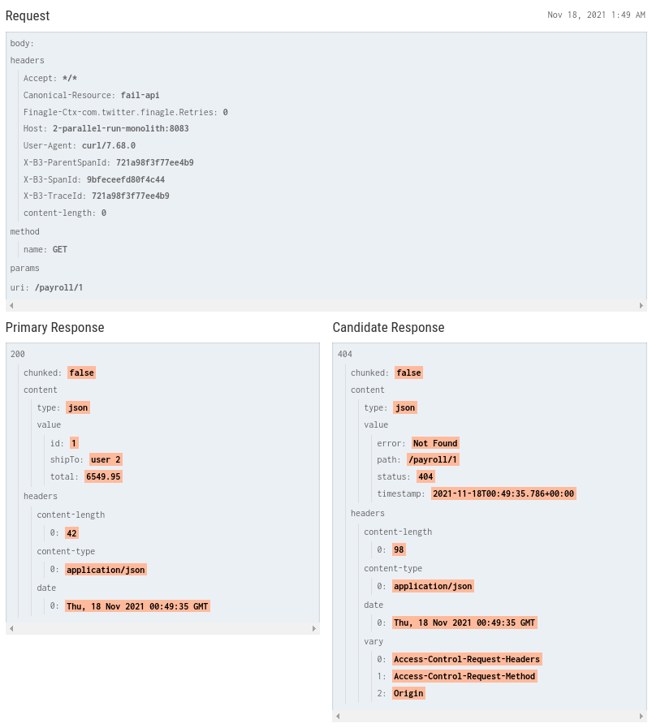

<h1 align="center"><b>Parallel Run</b></h1></div>

<div align="center">

[](https://github.com/MasterCloudApps-Projects/Monolith-to-Microservices-Examples/tree/master/Parallel_Run/README.md)
[](https://github.com/MasterCloudApps-Projects/Monolith-to-Microservices-Examples/tree/master/Parallel_Run/README.es.md)
</div>

En los patrones anteriormente estudiados `Strangler Fig` y `Branch By Abstraction`, teníamos la posibilidad de que coexistiera la versión antigua y nueva de la funcionalidad, pero sólamente una de ellas se activaba en un momento concreto.

Este patrón, `Parallel Run` en lugar de llamar a la implementación antigua o nueva, llamamos a ambas, lo que nos permite comparar los resultados para asegurarnos de que sean equivalentes.
<div align="center">


</div>

Utiliza la técnica de `Dark Launching`, implementar una nueva funcionalidad pero que sea invisible para los usuarios. `Parallel Run` es una forma de implementar esta técnica, ya que la nueva funcionalidad es invisible para el usuario.

## **Ejemplo 1. Usando Spies**
____________________________________________________________
### **Paso 1**
Partimos de nuestra aplicación monolítica que loguea notificaciones al usuario.
```
docker-compose -f Example_1/1_docker-compose.yml up 
```
```
docker-compose -f Example_1/1_docker-compose-proxy.yml up -d
```

Probamos que todo funciona correctamente:

```
curl -v -H "Content-Type: application/json" -d '{"shipTo":"Juablaz","total":320}' payment.service/payroll
```

### **Paso 2**
En este paso, tenemos que sacar una versión 2 del monolito, que registre en BBDD la notificación al usuario.
También, debemos desarrollar nuestro microservicio, con una implementación modificada, que no envíe realmente la notificación pero registre que la registre como que se hubiera enviado (``Spy``). Ambas implementaciones van a convivir y no queremos que se dupliquen las notificaciones.
<div align="center">


</div>

```
docker-compose -f Example_1/2_docker-compose.yml up 
```

Podemos probar nuestra nueva implementación del monolito `v2`:

```
curl -v -H "Content-Type: application/json" -d '{"shipTo":"Juablaz","total":320}' localhost:8082/payroll
```

Con todo desplegado, vamos a migrar las peticiones a la nueva implementación.

```
docker-compose -f Example_1/2_docker-compose-proxy.yml up -d
```

En este momento, se registra en la BBDD desde el microservicio y desde el monolito el envío de notificaciones. Tenemos un microservicio con un batch que periódicamente realiza una comparación de los resultados generados.
Este microservicio, devuelve ``true`` or ``false`` en caso de tener las BBDD equitativas.

Hemos habilitado una opción para que podamos ejecutarlo de forma manual:

```
curl -v  http://localhost:8083/notification/comparation
```

Devuelve ``true`` y loguea:
```
> 2_parallel_run_batch_service      | 2021-10-11 09:49:25.334  INFO 1 --- [nio-8083-exec-2] e.c.m.p.service.UserNotificationService  : ConsumitionsCount: 6 for mono size: 6 and micro size: 6
```

### **Paso 3**

Una vez hayamos visto que la nueva implementación en el microservicio genera los mismos resultados que el monolito, podemos sacar una versión final.

```
docker-compose -f Example_1/3_docker-compose.yml up --build
```

Probamos que funcione correctamente:
```
curl -v -H "Content-Type: application/json" -d '{"shipTo":"Juablaz","total":320}' localhost:8084/payroll
```

Migramos las peticiones a la versión final:
```
docker-compose -f Example_1/3_docker-compose-proxy.yml up -d
```

```
curl -v -H "Content-Type: application/json" -d '{"shipTo":"Juablaz","total":320}' payment.service/payroll
```

<br>

## **Ejemplo 2. Github Scientist**
____________________________________________________________
Existen librerías que permiten comparar resultados de forma muy sencilla. En nuestro caso, vamos a proceder a realizar un ejemplo con:
https://github.com/rawls238/Scientist4J

El ejemplo anterior, la comparación se realizaba en background, a través de nuestro batch, sin embargo, puede ser necesario que implementemos esa lógica en tiempo real. Por contra, esta solución añade latencias y puede no ser eficiente utilizarla en nuestra solución.

También podemos hacer una comparación en background, dejando el hilo principal de la aplicación procesando el flujo de las notificaciones del monolito y realizar una comparación con la librería de forma asíncrona en otro hilo, publicando la respuesta en una BBDD.

Para aplicar este ejemplo, debemos tomar parte de la lógica utilizada en el anterior ejemplo del patrón y tener una versión Spy de nuestro microservicio, para evitar duplicar las notificaciones.

Vamos a realizar un ejemplo de comparación en tiempo real de resultados a través de la librería presentada anteriormente:

### **Paso 1**
Partimos de nuestra aplicación monolítica que loguea notificaciones al usuario.
```
docker-compose -f Example_2/1_docker-compose.yml up 
```
```
docker-compose -f Example_2/1_docker-compose-proxy.yml up -d
```

Probamos que todo funciona correctamente:

```
curl -v -H "Content-Type: application/json" -d '{"shipTo":"Juablaz","total":320}' payment.service/payroll
```

### **Paso 2**
La librería tiene un uso sencillo, en caso de querer comparar dos operaciones síncronas:

```java
Experiment<Integer> e = new Experiment("foo");
e.run(this::controlFunction, this::candidateFunction);
```

En caso de ser asíncronas:

```java
Experiment<Integer> e = new Experiment("foo");
e.runAsync(this::controlFunction, this::candidateFunction);
```

En nuestro caso, debemos hacer una pequeña modificación al código del monolito y del microservicio, puesto que nuestras operaciones son `void`. Vamos a retornar un ``String`` almacenado previamente para este ejemplo en un ``ConcurrentMap``. Esto nos permite comparar las llamadas newCode/oldCode de lo que nos ha creado la nueva implementacion con la que ya habia:
```java
public Boolean scientistExperiment(Long id) {
        DropwizardMetricsProvider metricRegistry = new DropwizardMetricsProvider();
        Experiment<String> experiment = new Experiment<>("notify", metricRegistry);

        Callable<String> oldCodePath = () -> userNotificationService.getNotify(id);
        Callable<String> newCodePath = () -> userNotificationServiceMS.getNotify(id);
        try {
            experiment.run(oldCodePath, newCodePath);
        } catch (Exception e) {
            System.out.println(e);
        }

        MetricName metricName = MetricName.build("scientist.notify.mismatch");
        Counter result = metricRegistry.getRegistry().getCounters().get(metricName);

        log.info("The ScientistExperiment result with compare oldCode/newCode is " + result.getCount() + " mismatch");
        return result.getCount() == 0;
    }
```

```
docker-compose -f Example_2/2_docker-compose.yml up 
```

```
curl -v -H "Content-Type: application/json" -d '{"shipTo":"Juablaz","total":320}' localhost:8082/payroll
```


Actualizamos a utilizar el proxy:

```
docker-compose -f Example_2/2_docker-compose-proxy.yml up -d
```

```
curl -v -H "Content-Type: application/json" -d '{"shipTo":"Juablaz","total":320}' payment.service/payroll
```


### **Paso 3**

Una vez hayamos visto que la nueva implementación en el microservicio genera los mismos resultados que el monolito, podemos sacar una versión final.

```
docker-compose -f Example_2/3_docker-compose.yml up
```

```
curl -v -H "Content-Type: application/json" -d '{"shipTo":"Juablaz","total":320}' localhost:8084/payroll
```

Migramos las peticiones a la versión final:
```
docker-compose -f Example_2/3_docker-compose-proxy.yml up -d
```

```
curl -v -H "Content-Type: application/json" -d '{"shipTo":"Juablaz","total":320}' payment.service/payroll
```

<br>

## **Ejemplo 3. Diferencia**
____________________________________________________________
Este ejemplo es algo diferente. En realidad `Diffy` actuaria como un proxy externo, en nuestro caso como un comparador externo.

Diffy encuentra posibles errores en su servicio utilizando instancias en ejecución de la nueva funcion de código y el antiguo, uno al lado del otro, Monolito y MicroServicio en Parallel Run. Diffy se comporta como un proxy y multiplica las peticiones que recibe a cada una de las instancias en ejecución. A continuación, compara las respuestas e informa de cualquier regresión que pueda surgir de esas comparaciones. La premisa de Diffy es que si dos implementaciones del servicio devuelven respuestas "similares", para un conjunto suficientemente grande y diverso de peticiones. Entonces las dos implementaciones son equivalentes, la implementación más nueva podria ser definitiva.

### **Paso 1**
Partimos de nuestra aplicación monolítica que loguea notificaciones al usuario.
```
docker-compose -f Example_3/1_docker-compose.yml up 
```
```
docker-compose -f Example_3/1_docker-compose-proxy.yml up -d
```

Probamos que todo funciona correctamente:

```
curl -v -H "Content-Type: application/json" -d '{"shipTo":"Juablaz","total":320}' payment.service/payroll
```

### **Paso 2**
Primero, tendriamos que inicializar los dos contenedores con sus respectivas proxys:
<div align="center">


</div>


En el esquema anterior, Diffy actúa como un proxy que acepta peticiones procedentes de cualquier fuente que proporcionemos y multiplica cada una de esas peticiones a tres instancias del servicio diferentes:

- Una instancia candidata que ejecuta tu nuevo código
- Una instancia primaria que ejecuta su último código conocido
- Una instancia secundaria que ejecuta el mismo código bueno conocido que la instancia primaria

Cuando Diffy recibe una solicitud, la distribuye y la envía a sus instancias candidata, primaria y secundaria. Cuando esos servicios envían respuestas de vuelta, Diffy compara esas respuestas y busca dos cosas:

- Las diferencias brutas observadas entre las instancias candidata y primaria.
- Ruido no determinista observado entre las instancias primaria y secundaria.

Dado que ambas instancias están ejecutando un código supuestamente bueno, debería esperar que las respuestas coincidan. Si no es así, su servicio puede tener un comportamiento no determinista, lo cual es de esperar.

Para ello, ejecutamos independientemente nuestro monolito y nuestra nueva implementación: 

```
docker-compose -f Example_3/2_docker-compose.yml up --build
```
Diffy mide la frecuencia con la que el primario y el secundario discrepan entre sí frente a la frecuencia con la que el primario y el candidato discrepan entre sí. Si estas mediciones son aproximadamente iguales, entonces Diffy determina que no hay nada malo y que el error puede ser ignorado.En este caso, la respuesta seria la misma, si no el te la saca con un porcentaje de diferencia.

Con esta configuración, se puede acceder a la interfaz web de Diffy mediante un navegador a través de la URL http://localhost:3000
<div align="center">


</div>

Se ha añadido la cabecera Canonical-Resource a la petición, para que Diffy pueda tener una mejor referencia a la API y mostrarla en su interfaz.Y podemos interactuar con el proxy de Diffy a través de la URL: http://localhost:3001

```
curl -s -i -H Canonical-Resource:success-api localhost:3001/notification/1
```
<div align="center">


</div>

### **Paso 3**
Una vez hayamos visto que la nueva implementación en el microservicio genera los mismos resultados que el monolito, podemos sacar una versión final.

```
docker-compose -f Example_2/3_docker-compose.yml up -d
```

```
curl -v -H "Content-Type: application/json" -d '{"shipTo":"Juablaz","total":320}' localhost:8084/payroll
```

Migramos las peticiones a la versión final:
```
docker-compose -f Example_2/3_docker-compose-proxy.yml up -d
```

```
curl -v -H "Content-Type: application/json" -d '{"shipTo":"Juablaz","total":320}' payment.service/payroll
```

<br>

## **Ejemplo 4. Canary Releasing**
____________________________________________________________
<div align="center">

[](https://www.youtube.com/watch?v=BpS9Syoid6o)
</div>

### **Paso 1**
Lanzar una versión Canary para un subconjunto de usuarios, por si se produce algún problema sólo un pequeño grupo de usuarios se verán afectados.

Hemos configurado un nginx como `Load Balancer` que nos permite balancear la carga utilizando pesos.

Recordemos que estamos extrayendo la funcionalidad de `User Notification`.

```
docker-compose -f Example_4/1_docker-compose-monolith.yml up --build
```
```
docker-compose -f Example_4/1_docker-compose-proxy.yml up -d
```

La configuración por defecto es la siguiente:
```
upstream loadbalancer {
  server 1-parallel-run-monolith:8080 weight=10;
}
server {
  listen 8080;
  server_name payment.service;

  location / {
    proxy_pass http://loadbalancer;
  }
}
```

Toda la carga de peticiones irán a nuestro monolito.

Nuestra aplicación es accesible a través de:

```
curl payment.service/payroll
```

Todas las peticiones van al monolito.


### **Paso 2**
Lanzamos una nueva versión de la aplicación.

```
docker-compose -f Example_4/2_docker-compose.yml up --build
```

Podemos probarla utilizando peticiones directas al monolito v2 y al microservicio

```
curl -v -H "Content-Type: application/json" -d '{"shipTo":"Juablaz","total":320}' localhost:8082/payroll
```

### **Paso 3**
Vamos a migrar poco a poco las peticiones.

Pero antes, vamos a ejecutar nuestro generador de peticiones:
```
cd ..\Request Generator\
```

```
node request_generator.js http://payment.service/payroll 1000 payroll.json
```

Tiempo en segundos que estaremos lanzando peticiones, el json que manda y a qué petición.

```
upstream loadbalancer {
  server 1-parallel-run-monolith:8080 weight=9;
  server 2-parallel-run-monolith:8080 weight=1;
}
server {
  listen 80;
  server_name payment.service;
  location / {
    proxy_pass http://loadbalancer;
  }
}
```

Facilitamos diferentes archivos de configuración que se irían aplicando según viéramos que la versión "Canary" con nuestro microservicio fuera funcionando:
- nginx_0_100
- nginx_10_90
- nginx_20_80
- ...
- nginx_80_20
- nginx_90_10
- nginx_100_0

Arrancamos una nueva configuración del nginx:

```
docker-compose -f Example_4/3_docker-compose-proxy-10-90.yml up -d
```
```
docker-compose -f Example_4/3_docker-compose-proxy-50-50.yml up -d
```
```
docker-compose -f Example_4/3_docker-compose-proxy-90-10.yml up -d
```
```
docker-compose -f Example_4/3_docker-compose-proxy-100-0.yml up -d
```

Podemos realiar varias peticiones para verificar de forma aproximada los pesos:

```
curl payment.service/inventory
```

En caso de cualquier problema siempre se puede hacer un rollback y redirigir de nuevo las peticiones al monolito inicial.
```
docker-compose -f  Example_4/1_docker-compose-proxy.yml up -d
```

