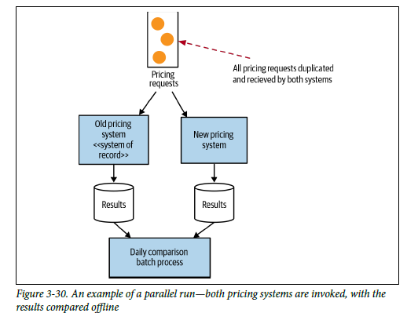
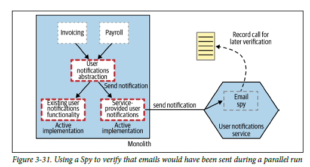
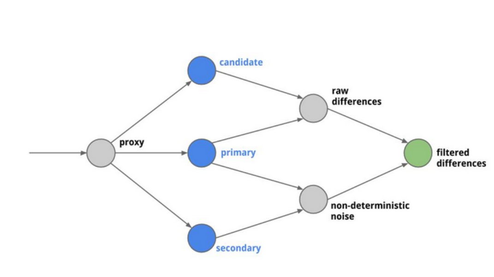
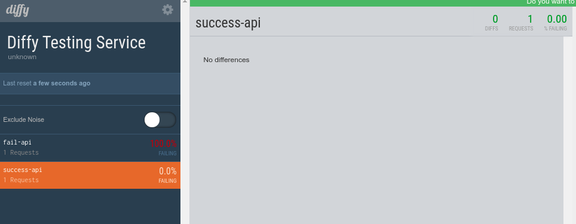
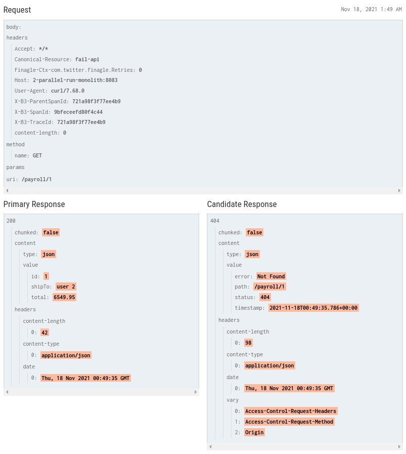

# **Parallel Run**

<div align="center">

[](https://github.com/MasterCloudApps-Projects/Monolith-to-Microservices-Examples/tree/master/Parallel_Run/README.md)
[](https://github.com/MasterCloudApps-Projects/Monolith-to-Microservices-Examples/tree/master/Parallel_Run/README.es.md)
</div>


In the previously studied patterns `Strangler Fig` and `Branch By Abstraction`, we had the possibility that the old and new version of the functionality coexisted, but only one of them was activated at a specific time.

This `Parallel Run` pattern, instead of calling either the old or the new implementation, we call both, which allows us to compare the results to make sure they are equivalent.

<div align="center">


</div>

It uses the `Dark Launching` technique, to implement a new feature but make it invisible to the users. `Parallel Run` is a way to implement this technique, since the new feature is invisible to the user.

## **Example 1. Using Spies**
____________________________________________________________
### **Step 1**
We start from our monolithic application that logs user notifications.
```
docker-compose -f Example_1/1_docker-compose.yml up 
```
```
docker-compose -f Example_1/1_docker-compose-proxy.yml up -d
```

We test that everything is working properly:

```
curl -v -H "Content-Type: application/json" -d '{"shipTo":"Juablaz","total":320}' payment.service/payroll
```

### **Step 2**
In this step, we have to produce a version 2 of the monolith, which registers in the DB the notification to the user.
Also, we must develop our microservice, with a modified implementation, that does not actually send the notification but records it as having been sent (``Spy``). Both implementations will coexist and we do not want duplicate notifications.

<div align="center">


</div>

```
docker-compose -f Example_1/2_docker-compose.yml up 
```

We can test our new monolith v2 implementation:

```
curl -v -H "Content-Type: application/json" -d '{"shipTo":"Juablaz","total":320}' localhost:8082/payroll
```

With everything deployed, let's migrate the requests to the new implementation.

```
docker-compose -f Example_1/2_docker-compose-proxy.yml up -d
```

At this moment, the sending of notifications is registered in the database from the microservice and from the monolith. We have a microservice with a batch that periodically performs a comparison of the generated results.
This microservice returns ``true`` or ``false`` in case of having equal DBs.

We have enabled an option so that we can run it manually:

```
curl -v  http://localhost:8083/notification/comparation
```

Returns ``true`` and logs in:
```
> 2_parallel_run_batch_service      | 2021-10-11 09:49:25.334  INFO 1 --- [nio-8083-exec-2] e.c.m.p.service.UserNotificationService  : ConsumitionsCount: 6 for mono size: 6 and micro size: 6
```

### **Step 3**

Once we have seen that the new implementation in the microservice generates the same results as the monolith, we can release a final version.

```
docker-compose -f Example_1/3_docker-compose.yml up -d
```

We test that it works correctly:
```
curl -v -H "Content-Type: application/json" -d '{"shipTo":"Juablaz","total":320}' localhost:8084/payroll
```

We migrate the requests to the final version:
```
docker-compose -f Example_1/3_docker-compose-proxy.yml up -d
```

```
curl -v -H "Content-Type: application/json" -d '{"shipTo":"Juablaz","total":320}' payment.service/payroll
```

<br>

## **Example 2. Github Scientist**.
____________________________________________________________
There are libraries that allow you to compare results in a very simple way. In our case, we will proceed to perform an example with:
https://github.com/rawls238/Scientist4J

In the previous example, the comparison was done in background, through our batch, however, we may need to implement this logic in real time. On the other hand, this solution adds latencies and may not be efficient to use in our solution.

We can also make a background comparison, leaving the main thread of the application processing the flow of the monolith notifications and make a comparison with the library asynchronously in another thread, publishing the answer in a DB.

To apply this example, we must take some of the logic used in the previous example of the pattern and have a Spy version of our microservice, to avoid duplicating notifications.

We are going to perform an example of real-time comparison of results through the library presented above:

### **Step 1**
We start from our monolithic application that logs user notifications.
```
docker-compose -f Example_2/1_docker-compose.yml up 
```
```
docker-compose -f Example_2/1_docker-compose-proxy.yml up -d
```

We test that everything is working properly:

```
curl -v -H "Content-Type: application/json" -d '{"shipTo":"Juablaz","total":320}' payment.service/payroll
```

### **Step 2**
The library has a simple use, in case you want to compare two synchronous operations:

```java
Experiment<Integer> e = new Experiment("foo");
e.run(this::controlFunction, this::candidateFunction);
```
If asynchronous:
```java
Experiment<Integer> e = new Experiment("foo");
e.runAsync(this::controlFunction, this::candidateFunction);
```

In our case, we must make a small modification to the monolith and microservice code, since our operations are `void`. We are going to return a ``String`` previously stored for this example in a ``ConcurrentMap``. This allows us to compare the newCode/oldCode calls of what the new implementation has created with the existing one:
```
public Boolean scientistExperiment(Long id) {
        DropwizardMetricsProvider metricRegistry = new DropwizardMetricsProvider();
        Experiment<String> experiment = new Experiment<>("notify", metricRegistry);

        Callable<String> oldCodePath = () -> userNotificationService.getNotify(id);
        Callable<String> newCodePath = () -> userNotificationServiceMS.getNotify(id);
        try {
            experiment.run(oldCodePath, newCodePath);
        } catch (Exception e) {
            System.out.println(e);
        }

        MetricName metricName = MetricName.build("scientist.notify.mismatch");
        Counter result = metricRegistry.getRegistry().getCounters().get(metricName);

        log.info("The ScientistExperiment result with compare oldCode/newCode is " + result.getCount() + " mismatch");
        return result.getCount() == 0;
    }
```

### **Step 3**

Once we have seen that the new implementation in the microservice generates the same results as the monolith, we can release a final version.

```
docker-compose -f Example_2/3_docker-compose.yml up -d
```

```
curl -v -H "Content-Type: application/json" -d '{"shipTo":"Juablaz","total":320}' localhost:8084/payroll
```

We migrate the requests to the final version:
```
docker-compose -f Example_2/3_docker-compose-proxy.yml up -d
```

```
curl -v -H "Content-Type: application/json" -d '{"shipTo":"Juablaz","total":320}' payment.service/payroll
```

<br>

## **Example 3. Diffy**
____________________________________________________________
This example is somewhat different. Actually `Diffy` is mounted on top of a proxy that would act in our case as an external comparator.

Diffy finds potential bugs in your service using running instances of your new code and your old code side by side. Diffy behaves as a proxy and multicasts whatever requests it receives to each of the running instances. It then compares the responses, and reports any regressions that may surface from those comparisons. The premise for Diffy is that if two implementations of the service return “similar” responses for a sufficiently large and diverse set of requests, then the two implementations can be treated as equivalent and the newer implementation is regression-free.

### **Step 1**
We start from our monolithic application that logs user notifications.
```
docker-compose -f Example_3/1_docker-compose.yml up 
```
```
docker-compose -f Example_3/1_docker-compose-proxy.yml up -d
```

We test that everything is working properly:

```
curl -v -H "Content-Type: application/json" -d '{"shipTo":"Juablaz","total":320}' payment.service/payroll
```
### **Step 2**
First, we would have to initialize the two containers with their respective proxies:

<div align="center">


</div>

In the above schema, Diffy acts as a proxy that accepts requests drawn from any source that you provide and multicasts each of those requests to three different service instances:

A candidate instance running your new code
A primary instance running your last known-good code
A secondary instance running the same known-good code as the primary instance
As Diffy receives a request, it is multicast and sent to your candidate, primary, and secondary instances. When those services send responses back, Diffy compares those responses and looks for two things:

Raw differences observed between the candidate and primary instances.
Non-deterministic noise observed between the primary and secondary instances. Since both of these instances are running known-good code, you should expect responses to be in agreement. If not, your service may have non-deterministic behavior, which is to be expected.

To do this, we independently run both our monolith and our new implementation: 

```
docker-compose -f Example_3/2_docker-compose.yml up --build
```

Diffy measures how often primary and secondary disagree with each other vs. how often primary and candidate disagree with each other. If these measurements are roughly the same, then Diffy determines that there is nothing wrong and that the error can be ignored.

With this configuration, the web interface from Diffy can be accessed via a browser through the URL http://localhost:3000



The header Canonical-Resource was added to the request, so the Diffy can have a better reference to the API and display it in your interface.And, we can interact with the Diffy proxy through the URL: http://localhost:3001
```
curl -s -i -H Canonical-Resource:success-api localhost:3001/notification/1
```




### **Step 3**
Once we have seen that the new implementation in the microservice generates the same results as the monolith, we can release a final version.

```
docker-compose -f Example_3/3_docker-compose.yml up -d
```

```
curl -v -H "Content-Type: application/json" -d '{"shipTo":"Juablaz","total":320}' localhost:8084/payroll
```

We migrate the requests to the final version:
```
docker-compose -f Example_2/3_docker-compose-proxy.yml up -d
```

```
curl -v -H "Content-Type: application/json" -d '{"shipTo":"Juablaz","total":320}' payment.service/payroll
```

<br>

## **Example 4. Canary Releasing**
____________________________________________________________
<div align="center">

[](https://www.youtube.com/watch?v=BpS9Syoid6o)
</div>

### **Step 1**
Release a Canary version for a subset of users, so that if a problem occurs only a small group of users will be affected.

We have configured an nginx `Load Balancer` which allows us to load balance using weights.

Let's remember that we are extracting the functionality of `User notification`.

```
docker-compose -f Example_4/1_docker-compose-monolith.yml up --build
```
```
docker-compose -f Example_4/1_docker-compose-proxy.yml up -d
```

The default configuration is as follows:
```
upstream loadbalancer {
  server 1-parallel-run-monolith:8080 weight=10;
}
server {
  listen 8080;
  server_name payment.service;

  location / {
    proxy_pass http://loadbalancer;
  }
}
```

The entire load of petitions will go to our monolith.

Our application is accessible through:

```
curl payment.service/payroll
```

All petitions go to the monolith.


### **Step 2**
We are launching a new version of the application.

```
docker-compose -f Example_4/2_docker-compose.yml up --build
```

We can test it using direct requests to monolith v2 and microservice

```
curl -v -H "Content-Type: application/json" -d '{"shipTo":"Juablaz","total":320}' localhost:8082/payroll
```

### **Step 3**
We will gradually migrate the requests.

But first, let's run our request generator:
```
cd ..\Request Generator\
```

```
node request_generator.js http://payment.service/payroll 1000 payroll.json
```

Time in seconds that we will be launching requests, the json that sends and to which request.

```
upstream loadbalancer {
  server 1-parallel-run-monolith:8080 weight=9;
  server 2-parallel-run-monolith:8080 weight=1;
}
server {
  listen 80;
  server_name payment.service;
  location / {
    proxy_pass http://loadbalancer;
  }
}
```

We provided different configuration files that would be applied as we saw that the "Canary" version with our microservice was working:
- nginx_0_100
- nginx_10_90
- nginx_20_80
- ...
- nginx_80_20
- nginx_90_10
- nginx_100_0

We start a new nginx configuration:

```
docker-compose -f Example_4/3_docker-compose-proxy-10-90.yml up -d
```
```
docker-compose -f Example_4/3_docker-compose-proxy-50-50.yml up -d
```
```
docker-compose -f Example_4/3_docker-compose-proxy-90-10.yml up -d
```
```
docker-compose -f Example_4/3_docker-compose-proxy-100-0.yml up -d
```

We can make several requests to verify approximate weights:

```
curl payment.service/inventory
```

In case of any problem you can always rollback and redirect the requests back to the initial monolith.
```
docker-compose -f  Example_4/1_docker-compose-proxy.yml up -d
```
