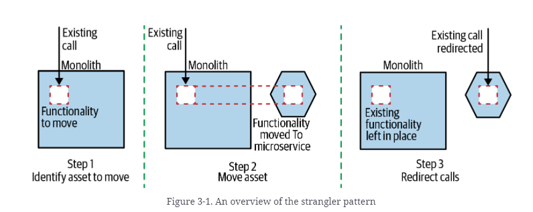
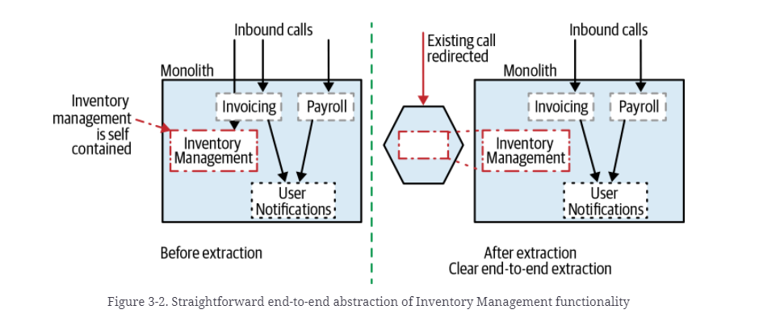
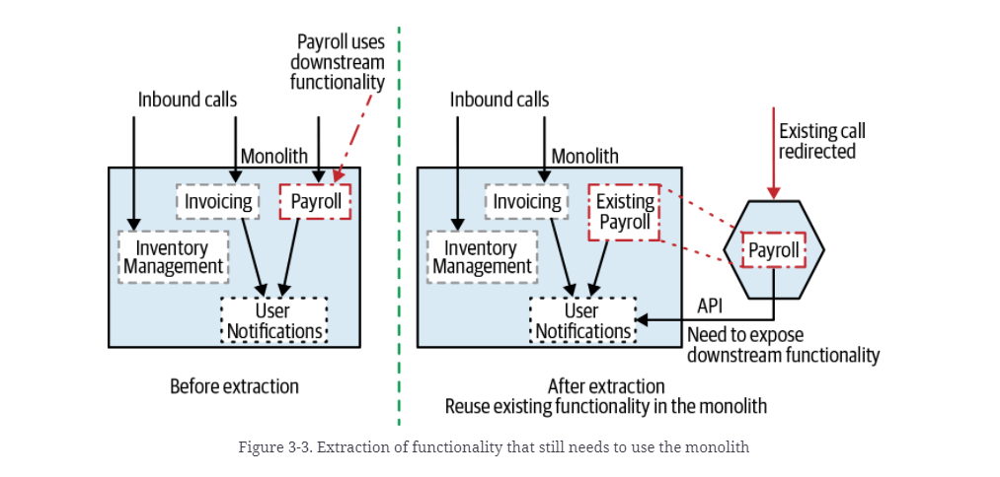
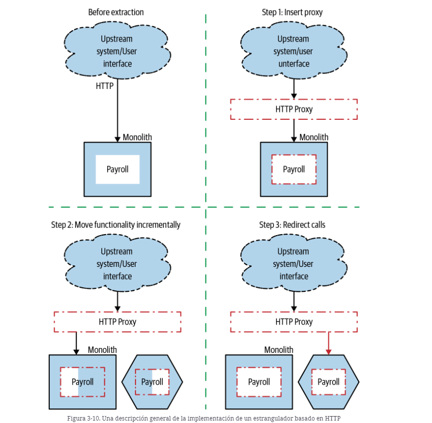

# Strangler Fig

http://localhost:8080/swagger-ui/

3 pasos:

1. Tenemos el monolito, llega una petición y se responde a partir del monolito.
2. Debe implementar esta funcionalidad en su nuevo microservicio.
3. Con su nueva implementación lista, debe poder redireccionar las llamadas desde el monolito a su nuevo y brillante microservicio.

# Ejemplo 1. Extracción de Inventory Management.
Vamos a aplicar el patrón en el siguiente ejemplo con los tres pasos explicados anteriormente, extrayendo la funcionalidad de Inventory:

# Ejemplo 2. Extracción de Payroll.
Si deseamos aplicar el patrón sobre Payroll, que utiliza una funcionalidad interna en el monolito (User notification), debemos exponer la funcionalidad a través de una API.

# Ejemplo 3. Extracción de User Notification.
Si deseamos extraer la funcionalidad de User Notification, al llamarse desde diferentes partes del monolito no podemos redirigir las llamadas fuera del sistema. Para ello deberemos utilizar al patrón Branch By Abstraction.

# Ejemplo 4. Uso de HTTP Proxy.
https://dzone.com/articles/how-to-nginx-reverse-proxy-with-docker-compose

Ejemplo con HTTP Proxy(ng-inx) + docker-compose.
Con el ejemplo de payroll, se sugiere el uso de un proxy en 3 etapas.
1. Añadir un proxy que permita que todas las peticiones vayan al monolito.
2. Con el proxy activo, realizamos la extracción de nuestro microservicio. Sugiere el uso de múltiples pasos:
    - Implementar el microservicio vacío, sin funcionalidad retornando 501 Not Implemented. Sugiere incluso ponerlo en producción para poder probarlo.
    - Añadir la funcionalidad al microservicio
3. Mover las peticiones del monolito al microservicio. Si hay un error podemos redirigir las peticiones de nuevo al monolito.

# Ejemplo 5. Interceptación de mensajes.
Tenemos un monolito que recibe mensajes a través de una cola.

<h3>Continuará...</h3>