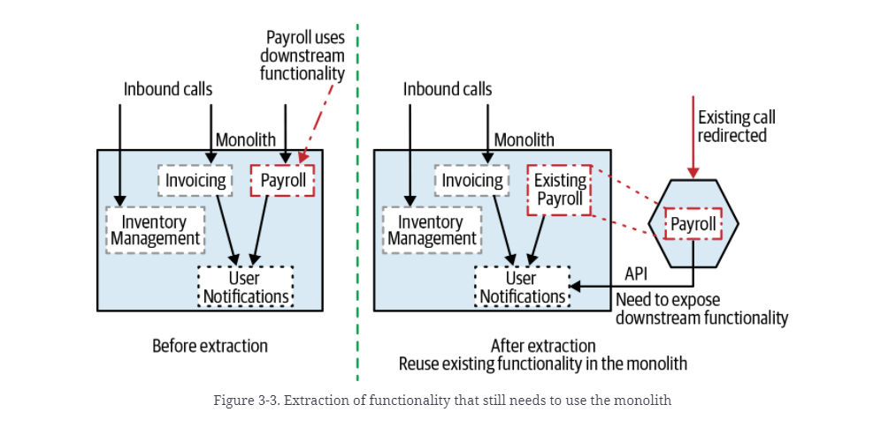

# **Strangler Fig**
<div align="center">

[](https://github.com/MasterCloudApps-Projects/Monolith-to-Microservices-Examples/tree/master/Strangler_Fig/README.md)
[](https://github.com/MasterCloudApps-Projects/Monolith-to-Microservices-Examples/tree/master/Strangler_Fig/README.es.md)
</div>

El patrón `Strangler Fig` consiste en la migración de forma incremental y gradual de las funcionalidades específicas situadas dentro del monolito a microservicios independientes.

El patrón se divide en 3 pasos:
1. Aplicación monolítica. Las peticiones y funcionalidades se responden dentro del mismo.
2. Implementación de la funcionalidad en un nuevo microservicio.
3. Con su nueva implementación lista, migramos las peticiones del monolito al microservicio.

<div align="center">


</div>

Vamos a aplicar el patrón en diferentes ejemplos con los tres pasos explicados anteriormente.

<br>

## **Ejemplo 1. Extracción de funcionalidad independiente**
____________________________________________________________

Para poder realizar la migración de las peticiones y los despliegues en caliente, debemos configurar un proxy inverso. El host de nuestra aplicación va a ser: `payment.service`. 

Para ello, debemos añadir a:
- Linux: `/etc/hosts`
- Windows: `C:/Windows/System32/drivers/etc/hosts`

La siguiente línea: `127.0.0.1 payment.service`

Partimos de un monolito que contiene toda la lógica de la aplicación. Surge la necesidad de extraer una funcionalidad independiente, en este caso ``Inventory`` a un microservicio nuevo.

A continuación, se muestra una imagen del estado inicial y final de la aplicación tras aplicar el patrón.

<div align="center">


</div>

### **Paso 1**
Tenemos nuestra aplicación monolítica. Las peticiones y funcionalidades se responden dentro del mismo.
```
docker-compose -f Example_1/1_docker-compose-monolith.yml up  
```
```
docker-compose -f Example_1/1_docker-compose-proxy.yml up -d
```
[Nota 1](#note1)

Nuestro proxy está configurado para dirigir todas las peticiones al monolito existente. 

```
server {
  listen 80;
  server_name payment.service;

  location ~ ^/ {
    proxy_pass http://1-strangler-fig-monolith:8080;
  }
}
```

Podemos probar nuestro monolito a través de una petición a:
```
curl payment.service/inventory
```

### **Paso 2**
Debemos implementar la funcionalidad en un nuevo microservicio.
```
docker-compose -f Example_1/2_docker-compose-ms.yml up 
```

Las peticiones siguen llegando a nuestro monolito, pero podemos probar nuestro microservicio llamándolo directamente:
```
curl localhost:8081/inventory
```

Vemos que las respuestas vienen con el tag `[MS]` que hemos añadido en el inicializador de datos.

### **Paso 3**
Con su nueva implementación lista, procedemos a redireccionar las llamadas desde el monolito al nuevo microservicio.

```
docker-compose -f  Example_1/3_docker-compose-proxy.yml up -d
```

La nueva configuración del proxy es:
```
server {
  listen 80;
  server_name payment.service;

  location ~ ^/(?!(inventory)) {
    proxy_pass http://1-strangler-fig-monolith:8080;
  }

  location /inventory {
    proxy_pass http://2-strangler-fig-inventory-ms:8081;
  }
}
```

Probemos a realizar peticiones:
```
curl payment.service/inventory
```

Desde este momento, la respuesta contará con un prefijo ``[MS]`` que hemos añadido a los datos de ejemplo dados de alta de forma automática en el microservicio.

En caso de que se produzca cualquier problema siempre se puede hacer un rollback y redirigir de nuevo las peticiones al monolito.

```
docker-compose -f  Example_1/1_docker-compose-proxy.yml up -d
```

<br>

## **Ejemplo 2. Extracción de funcionalidad interna**
____________________________________________________________

Si deseamos aplicar el patrón sobre `Payroll` que utiliza una funcionalidad interna en el monolito `User Notifications`, debemos exponer dicha funcionalidad interna al exterior a través de un endpoint.

<div align="center">


</div>

¿Cómo encaja esto en nuestros 3 pasos?:

1. En caso de no disponer de proxy, debemos añadir uno que permita dirigir las peticiones. 
2. Con el proxy activo, realizamos la extracción a nuestro microservicio. Se podría realizar en varios pasos:
    - Creación del microservicio vacío, sin funcionalidad retornando `501 Not Implemented`. Se recomienda llevarlo a producción para familiarizarnos con el proceso de despliegue.
    - Implementación de la funcionalidad del microservicio.
3. Movemos las peticiones del monolito al microservicio de forma progresiva. Si hay un error podemos redirigir las peticiones de nuevo al monolito.

<div align="center">


</div>

### **Paso 1**
Tenemos nuestra aplicación monolítica, las peticiones y funcionalidades se responden dentro del mismo.

```
docker-compose -f Example_2/1_docker-compose-monolith.yml up 
```
```
docker-compose -f Example_2/1_docker-compose-proxy.yml up -d
```

Podemos probar nuestro monolito:
```
curl -v -H "Content-Type: application/json" -d '{"shipTo":"Juablaz","total":120}' payment.service/payroll
```

Se loguea en la notificación:
```
Payroll 3 shipped to Juablaz of 120.0
```

### **Paso 2**
Debemos implementar la funcionalidad en un nuevo microservicio que se comunicará con el monolito. Por tanto, el monolito debe exponer un endpoint para que el microservicio se conecte a través del él `/notification`.
Lanzamos una versión del monolito (`v2`) y nuestro nuevo microservicio.

```
docker-compose -f Example_2/2_docker-compose.yml up 
```

Podemos probar nuestro microservicio:

```
curl -v -H "Content-Type: application/json" -d '{"shipTo":"Juablaz", "total":220}' localhost:8081/payroll
```

Se loguea la notificación en el monolito nuevo (`v2`), por lo tanto la comunicación es correcta:
```
Payroll 3 shipped to Juablaz of 220.0
```

Las peticiones a través del proxy `payment.service` siguen llegando al monolito anterior, pero hemos probado el correcto funcionamiento del nuevo monolito y del microservicio.


### **Paso 3**
Con la nueva implementación lista, redirigimos las peticiones al monolito de la funcionalidad de `Payroll`.

```
docker-compose -f Example_2/3_docker-compose-proxy.yml up -d
```

La nueva configuración es:
```
server {
  listen 80;
  server_name payment.service;

  location ~ ^/(?!(payroll)) {
    proxy_pass http://2-strangler-fig-monolith:8082;
  }

  location /payroll {
    proxy_pass http://2-strangler-fig-payroll-ms:8081;
  }
}
```

Podemos probar nuestra aplicación:
```
curl -v -H "Content-Type: application/json" -d '{"shipTo":"Juablaz","total":320}' payment.service/payroll
```

Se loguea la notificación en la versión 2 del monolito `2_strangler_fig_monolith`:
```
Payroll 3 shipped to Juablaz of 320.0
```

En este punto podemos plantearnos quitar la versión 1 del monolito.
¿Qué ocurre si hemos tenido algún problema en la nueva versión?
Podemos rápidamente, cargar la configuración del proxy antigua:

```
docker-compose -f Example_2/1_docker-compose-proxy.yml up -d
```

De esta forma, las peticiones vuelven al monolito antiguo.

<br>

## **Ejemplo 3. Interceptación de mensajes.**
____________________________________________________________
En este ejemplo no hemos añadido un proxy para redirigir las peticiones puesto que el patrón no se basa en interceptar las peticiones HTTP, si no en interceptar y redirigir los mensajes de la cola de mensajería. Hemos implementado el ejemplo utilizando Kafka.

### **Paso 1**
Tenemos un monolito que recibe mensajes a través de una cola. 
Para ello, hemos creado también un productor de mensajes `strangler_fig_producer` y hemos configurado un sistema de colas basado en Kafka.
Está formado por dos topics: `invoicing-v1-topic` y `payroll-v1-topic`.

<div align="center">


</div>

```
docker-compose -f Example_3/1_docker-compose-kafka-queue.yml up -d
```
```
docker-compose -f Example_3/1_docker-compose-monolith.yml up --build
```
```
docker-compose -f Example_3/1_docker-compose-producer.yml up -d 
```

Hagamos una prueba a través de una petición:
```
curl -v -H "Content-Type: application/json" -d '{"shipTo":"Juablaz", "total":220}' localhost:9090/messages/send-payroll
```

Podemos ver cómo se loguea en nuestro monolito: 
```
Payroll 3 shipped to Juablaz of 220.0
```

Tenemos tres posibles casuísticas:
- a) Podemos cambiar el código del monolito.
- b) No podemos cambiar el código del monolito.
- c) No podemos cambiar la fuente de datos.

## **a) Podemos cambiar el código del monolito**
### **Paso 2**

<div align="center">


</div>

Tenemos que modificar el código del monolito para ignorar las peticiones de `Payroll`. Ya no tendrá configurado el `payroll-v1-topic` del que recibía mensajes. Además, necesitamos exponer el endpoint de `Notification` en el monolito para poder enviar notificaciones desde el microservicio. Por tanto, necesitamos una versión ``v2`` del monolito.

La complicación surge al seguir el patrón e intentar realizar la migración de las peticiones del monolito al microservicio. En este ejemplo, no tenemos peticiones y no podemos migrarlas a través del uso de un proxy, por lo que se nos plantea la necesidad de actualizar la fuente de datos.
- Para ello necesitamos crear nuevos topics a los que escribimos desde nuestro `Producer` y a los que nos conectamos desde el `Monolith-v2`. No podemos seguir escribiendo en el mismo topic que se utilizaba en la versión 1. En este caso estamos cambiando la fuente de información y es posible que dependiendo de la situación no podamos cambiarla.

Tendremos entonces a nuestro monolito `v1` leyendo datos de:
- invoicing-v1-topic
- payroll-v1-topic

Y a nuestro monolito `v2` lendo datos de:
- invoicing-v2-topic
- payroll-v2-topic

En la migración pasaremos de escribir en los topics `v1` a los topics `v2`.

[Nota 2](#note2)

Vamos a ejecutar el ejemplo siguiendo el patrón, primero la implementación y luego migrando los mensajes de la cola:

```
docker-compose -f  Example_3/2_a_docker-compose.yml up --build
```

Podemos probar nuestra nueva implementación del monolito:
```
curl -v localhost:8082/invoicing
```

### **Paso 3**
Vamos a migrar los mensajes a nuevos topics donde escribir. Cambiaremos nuestra fuente de datos a `invoicing-v2-topic` y a `payroll-v2-topic`.
```
docker-compose -f Example_3/3_a_docker-compose-producer.yml up -d --build
```

Probemos que funciona correctamente:
```
curl -v -H "Content-Type: application/json" -d '{"shipTo":"Juablaz", "total":220}' localhost:9090/messages/send-payroll
```

Se loguea en nuestro monolito `v2`:
```
Payroll 3 shipped to Juablaz of 220.0
```

Podemos confirmarlo mediante una petición al microservicio:
```
curl localhost:8081/payroll/3
```

En caso de error podemos cambiar la generación de datos al topic antiguo:
```
docker-compose -f  Example_3/1_docker-compose-producer.yml up -d
```

## **b) NO podemos cambiar el código del monolito**
### **Paso 2**


En este caso no podemos tocar el monolito. Necesitamos que exclusivamente lleguen mensajes de `Invoicing` al monolito porque no podemos quitar el procesado de los que llegan a `Payroll`. Además, no podemos loguear notificaciones desde el microservicio, puesto que tendríamos que exponer un endpoint como hemos hecho en el ejemplo anterior. 
Vamos a loguear la creación de Payroll en el propio microservicio para simplificar el ejemplo.

Nuestro flujo sería el siguiente:
- Llega una petición POST a `strangler-fig-producer`.
- Genera un mensaje a la cola de Kafka a los dos posibles topics `invoicing-all-msg-topic`, `payroll-all-msg-topic`
- Tenemos un microservicio de enrutamiento basado en contenido `strangler-fig-cbr` que consume y redirige los topics:
    - `payroll-v1-topic` - Monolito
    - `payroll-v2-topic` - Payroll
- El topic `payroll-v1-topic` se quedaría sin uso puesto que vamos a redirigir los mensajes al `v2-topic`.

Para aplicar esto al patrón, como hemos explicado en el anterior ejemplo, necesitamos crear nuevos topics a los que escribimos desde el `producer` y a los que nos conectamos desde el `cbr`. No podemos seguir escribiendo en el mismo topic que se utilizaba en la versión 1. En este caso estamos cambiando la fuente de información y es posible que dependiendo de la situación no podamos cambiarla.

Lanzamos una versión exactamente **igual** que la anterior del monolito, **cambiando los topics a los que se suscribe**.

```
docker-compose -f Example_3/2_b_docker-compose.yml up --build
```

Podemos probar nuestra nueva implementación del microservicio y el cbr:
```
curl -v localhost:8081/payroll
```

En este momento, las peticiones siguen llegando al topic antiguo, `payroll-v1-topic` y `invoicing-v1-topic`.


### **Paso 3**
Vamos a migrar las "peticiones". En este caso, se trata de migrar los mensajes a nuevos topics donde escribir, actualizar nuestra fuente de datos:

```
docker-compose -f Example_3/3_b_docker-compose-producer.yml up -d
```

Probemos que funciona correctamente:
```
curl -v -H "Content-Type: application/json" -d '{"shipTo":"Juablaz", "total":220}' localhost:9090/messages/send-payroll
```

Se loguea en nuestro microservicio (Recordemos que no se realiza la petición desde el microservicio al monolito para loguear puesto que no podemos cambiar el código del monolito):
```
Payroll 3 shipped to Juablaz of 220.0
```

En caso de error, podemos cambiar la escritura de datos al monolito antiguo:
```
docker-compose -f Example_3/1_docker-compose-producer.yml up -d
```

## **c) NO podemos cambiar la fuente de datos**
### **Paso 1.1**

Tras haber realizado los anteriores ejemplos, nos surge una duda durante la aplicación de este patrón. ¿Qué ocurre si no podemos cambiar la fuente de datos?

Para ello, partimos de una versión ampliada del monolito, que dispone de un flag de `FF4J` como los utilizados en el patrón [Branch by Abstraction](https://github.com/MasterCloudApps-Projects/Monolith-to-Microservices-Examples/tree/master/Branch_By_Abstraction/README.es.md).

```
docker stop example_3_step_1_strangler_fig_monolith
```
```
docker-compose -f Example_3/1_c_docker-compose-monolith.yml up --build
```

Hagamos una prueba a través de una petición:
```
curl -v -H "Content-Type: application/json" -d '{"shipTo":"Juablaz","total":220}' localhost:9090/messages/send-payroll
```

Podemos ver cómo se loguea en nuestro monolito: 
```
Payroll 3 shipped to Juablaz of 220.0
```

### **Paso 2**

Vamos a ejecutar el microservicio y a deshabilitar la consumición de payroll en el monolito:

```
docker-compose -f  Example_3/2_c_docker-compose-ms.yml up --build
```

Podemos probar nuestra implementación del microservicio:
```
curl -v localhost:8081/payroll
```

Si entramos en `http://localhost:8080/ff4j-web-console` y cambiamos el flag a deshabilitado, dejará de consumir el monolito y sólo se realizará a través del microservicio.

Este paso podríamos modificar el código del monolito para ampliarlo y añadir un `NotificationController` que permita loguear notificaciones a través del monolito, hemos decidido no modificarlo para simplificar el ejemplo.


### **Paso 3**
En este último paso, eliminaríamos el flag y la implementación antigua, reemplazando a la anterior versión del monolito.

```
docker stop example_3_step_1_c_strangler_fig_monolith
```
```
docker-compose -f Example_3/3_c_docker-compose-monolith.yml up --build
```

Hagamos una prueba a través de una petición:
```
curl -v -H "Content-Type: application/json" -d '{"shipTo":"Juablaz","total":220}' localhost:9090/messages/send-payroll
```

Podemos ver cómo se loguea en nuestro microservicio: 
```
Payroll 3 shipped to Juablaz of 220.0
```
<br>

# Enlaces de interés:

https://github.com/javieraviles/split-the-monolith

https://www.it-swarm-es.com/es/nginx/docker-nginx-proxy-como-enrutar-el-trafico-un-contenedor-diferente-utilizando-la-ruta-y-no-el-nombre-de-host/828289465/

https://refactorizando.com/kafka-spring-boot-parte-uno/

https://github.com/flipkart-incubator/kafka-filtering#:~:text=Kafka%20doesn't%20support%20filtering,deserialized%20%26%20make%20such%20a%20decision.

https://blog.cloudera.com/scalability-of-kafka-messaging-using-consumer-groups/

https://stackoverflow.com/questions/57952538/consuming-from-single-kafka-partition-by-multiple-consumers

<br>

# Comandos de interés:
Delete containers:
docker rm -f $(docker ps -a -q).

Delete volumes:
docker volume rm -f $(docker volume ls -q)

Delete images:
docker rmi -f $(docker images -a -q)

<br>

# Notas 

<a id="note1"></a>
### Nota 1:
   
``--build``: build images before starting containers.

``-d, --detach``: Detached mode: Run containers in the background, print new container names.

``--force-recreate``    Recreate containers even if their configuration
                        and image haven't changed.


------

<a id="note2"></a>
### Nota 2:
NOTA: 
Hemos configurado nuestro kafka para que automáticamente cree topics si no los encuentra, `KAFKA_AUTO_CREATE_TOPICS_ENABLE`, si esta configuración no está habilitada sería necesario conectarse al contenedor docker y ejecutar un comando. 

Se haría:

```
docker exec -it $(docker ps -aqf "name=ejemplo_3_kafka_1") bin/kafka-topics.sh --create --zookeeper zookeeper:2181 --replication-factor 1 --partitions 1 --topic payroll-v2-topic
```
```
docker exec -it $(docker ps -aqf "name=ejemplo_3_kafka_1") bin/kafka-topics.sh --create --zookeeper zookeeper:2181 --replication-factor 1 --partitions 1 --topic invoicing-v2-topic
```
