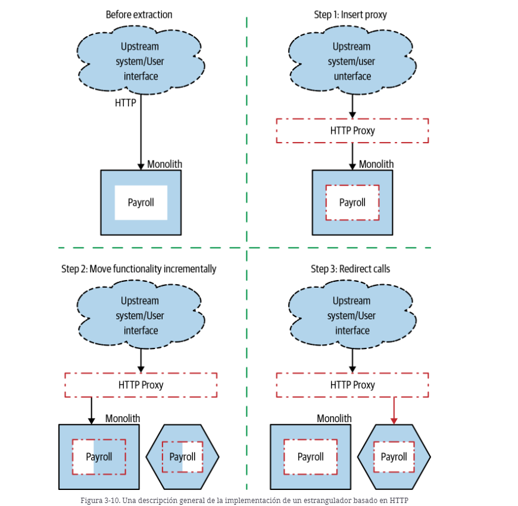
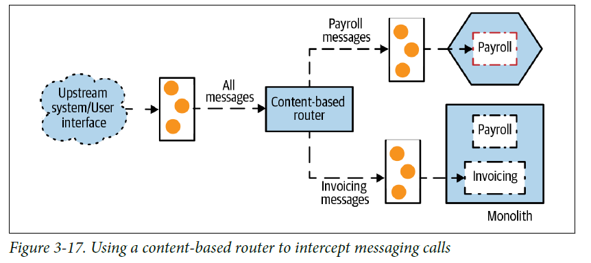

# Strangler Fig

El patrón ``Strangler Fig`` consiste en la migración de forma incremental y gradual de las funcionalidades específicas situadas dentro del monolito a microservicios independientes.

El patrón se divide en 3 pasos:
1. Aplicación monolítica, las peticiones y funcionalidades se responden dentro del mismo.
2. Implementación de la funcionalidad en un nuevo microservicio.
3. Con su nueva implementación lista, migramos las peticiones del monolito al microservicio.

<div align="center">


</div>

Vamos a aplicar el patrón en diferentes ejemplos con los tres pasos explicados anteriormente.

<br>

## **Ejemplo 1. Extracción de funcionalidad independiente**
____________________________________________________________

Para poder realizar la migración de las peticiones y los despliegues en caliente, debemos configurar un proxy inverso. El host de nuestra aplicación va a ser: `payment.service`. 

Para ello, debemos añadir a:
- Linux: `/etc/hosts`
- Windows: `C:/Windows/System32/drivers/etc/hosts`

La siguiente línea: `127.0.0.1 payment.service`

Partimos de un monolito que contiene toda la lógica de la aplicación. Surge la necesidad de extraer una funcionalidad independiente, en este caso ``Inventory`` a un microservicio nuevo.

A continuación, se muestra una imagen del estado inicial y final de la aplicación tras aplicar el patrón.

<div align="center">


</div>

### **Paso 1**
Tenemos nuestra aplicación monolítica, las peticiones y funcionalidades se responden dentro del mismo.
```
> docker-compose -f Ejemplo_1/1_docker-compose-monolith.yml up 

> docker-compose -f Ejemplo_1/1_docker-compose-proxy.yml up -d
```

Nuestro proxy, está configurado para dirigir todas las peticiones al monolito existente. 

```
server {
  listen 80;
  server_name payment.service;

  location ~ ^/ {
    proxy_pass http://1-strangler-fig-monolith:8080;
  }
}
```

Podemos probar nuestro monolito a través de una petición a:
```
> curl payment.service/inventory
```

### **Paso 2**
Debemos implementar la funcionalidad en un nuevo microservicio.
```
> docker-compose -f Ejemplo_1/2_docker-compose-ms.yml up
```

Las peticiones siguen llegando a nuestro monolito, pero podemos probar nuestro microservicio llamándolo directamente:
```
> curl localhost:8081/inventory
```

Vemos que las respuestas vienen con el tag ``[MS]`` que hemos añadido en el inicializador de datos.

### **Paso 3**
Con su nueva implementación lista, procedemos a redireccionar las llamadas desde el monolito al nuevo microservicio.

```
> docker-compose -f  Ejemplo_1/3_docker-compose-proxy.yml up -d
```

La nueva configuración del proxy es:
```
server {
  listen 80;
  server_name payment.service;

  location ~ ^/(?!(inventory)) {
    proxy_pass http://1-strangler-fig-monolith:8080;
  }

  location /inventory {
    proxy_pass http://2-strangler-fig-inventory-ms:8081;
  }
}
```

Probemos a realizar peticiones:
```
> curl payment.service/inventory
```

Ahora la respuesta contará con un prefijo ``[MS]`` que hemos añadido a los datos de ejemplo dados de alta de forma automática en el microservicio.

En caso de cualquier problema siempre se puede hacer un rollback y redirigir de nuevo las peticiones al monolito.

```
> docker-compose -f  Ejemplo_1/1_docker-compose-proxy.yml up -d
```

<br>

## **Ejemplo 2. Extracción de funcionalidad interna**
____________________________________________________________

Si deseamos aplicar el patrón sobre ``Payroll``, que utiliza una funcionalidad interna en el monolito ``User notification``, debemos exponer dicha funcionalidad interna al exterior a través de un endpoint.

<div align="center">


</div>

¿Cómo encaja esto en nuestros 3 pasos?:

1. Nuestro monolito, en caso de no disponer de proxy, debemos añadir uno que permita dirigir las peticiones.
2. Con el proxy activo, realizamos la extracción de nuestro microservicio. Se podría realizar en varios pasos:
    - Creación el microservicio vacío, sin funcionalidad retornando ``501 Not Implemented``. Se recomienda llevarlo a producción para familiarizarnos con el proceso de despliegue.
    - Implementación la funcionalidad del microservicio.
3. Movemos las peticiones del monolito al microservicio de forma progresiva. Si hay un error podemos redirigir las peticiones de nuevo al monolito.

<div align="center">


</div>

### **Paso 1**
Tenemos nuestra aplicación monolítica, las peticiones y funcionalidades se responden dentro del mismo.

```
> docker-compose -f Ejemplo_2/1_docker-compose-monolith.yml up 

> docker-compose -f Ejemplo_2/1_docker-compose-proxy.yml up -d
```

Podemos probar nuestro monolito:
```
> curl -v -H "Content-Type: application/json" -d '{"shipTo":"Juablaz","total":120}' payment.service/payroll
```

Se loguea en la notificación:
```
Payroll 3 shipped to Juablaz of 120.0
```

### **Paso 2**
Debemos implementar la funcionalidad en un nuevo microservicio que se comunicará con el monolito. Por tanto, el monolito debe exponer un endpoint para que el microservicio se conecte a través del él ```/notification```.
Lanzamos una versión del monolito (``v2``) y nuestro nuevo microservicio.

```
> docker-compose -f Ejemplo_2/2_docker-compose.yml up
```

Podemos probar nuestro microservicio:

```
> curl -v -H "Content-Type: application/json" -d '{"shipTo":"Juablaz","total":220}' localhost:8081/payroll
```

Se loguea la notificación en el monolito nuevo (``v2``), por lo tanto la comunicación es correcta:
```
Payroll 3 shipped to Juablaz of 220.0
```

Las peticiones a través del proxy ``payment.service`` siguen llegando al monolito anterior pero, hemos probado el correcto funcionamiento del nuevo monolito y del microservicio.


### **Paso 3**
Con la nueva implementación lista, redirigimos las peticiones al monolito de la funcionalidad de `Payroll`.

```
> docker-compose -f  Ejemplo_2/3_docker-compose-proxy.yml up -d
```

La nueva configuración es:
```
server {
  listen 80;
  server_name payment.service;

  location ~ ^/(?!(payroll)) {
    proxy_pass http://2-strangler-fig-monolith:8082;
  }

  location /payroll {
    proxy_pass http://2-strangler-fig-payroll-ms:8081;
  }
}
```

Podemos probar nuestra aplicación:
```
> curl -v -H "Content-Type: application/json" -d '{"shipTo":"Juablaz","total":320}' payment.service/payroll
```

Se loguea la notificación en el monolito v2:
```
Payroll 3 shipped to Juablaz of 320.0
```

En este punto podemos plantearnos quitar la versión 1 del monolito:

```
> docker-compose -f  Ejemplo_2/1_docker-compose_monolith.yml down
```

¿Y qué ocurre si hemos tenido algún problema en la nueva versión?
Podemos rápidamente, cargar la configuración del proxy antigua:

```
> docker-compose -f Ejemplo_2/1_docker-compose-proxy.yml up -d
```

De esta forma, las peticiones vuelven al monolito antiguo.

<br>

## **Ejemplo 3. Interceptación de mensajes.**
____________________________________________________________

### **Paso 1**
Tenemos un monolito que recibe mensajes a través de una cola. 
Para ello, hemos creado también un productor de mensajes `strangler_fig_producer` y hemos configurado un sistema de colas basado en Kafka.
Está formado por dos topics: `invoicing-v1-topic` y `payroll-v1-topic`.

<div align="center">


</div>

```
> docker-compose -f  Ejemplo_3/1_docker-compose.yml up

> docker-compose -f  Ejemplo_3/1_docker-compose-producer.yml up
```

Hagamos una prueba a través de una petición:
```
> curl -v -H "Content-Type: application/json" -d '{"shipTo":"Juablaz","total":220}' localhost:9090/messages/send-payroll
```

Podemos ver cómo se loguea en nuestro monolito: 
```
> Payroll 3 shipped to Juablaz of 220.0
```

Tenemos dos posibles casuísticas:
- Podemos cambiar el código monolito.
- No podemos cambiar el código del monolito.

## **Podemos cambiar el código del monolito**
### **Paso 2**

<div align="center">


</div>

Simplemente tenemos que modificar el código del monolito para ignorar las peticiones de ``Payroll``, ya no tendrá configurado el `payroll-v1-topic` del que recibía mensajes.

La complicación surge si necesitamos realizar un despliegue en caliente, sin parada de servicio. Para ello es necesario que cambiemos los topics de las colas a los que nos conectamos y desde el `` monolito-v2`` y a las que escribimos desde el ``producer`` porque si son las mismas que las del ``monolito-v1`` y ambas implementaciones conviven, se estarían procesando los datos por duplicado (en caso de poner diferente group-id) o balanceado (en caso de poner el mismo group-id).

------
NOTA: 
Hemos configurado nuestro kafka para que automáticamente cree topics si no los encuentra, `KAFKA_AUTO_CREATE_TOPICS_ENABLE`, si esta configuración no está habilitada sería necesario conectarse al contenedor docker y ejecutar un comando. 

Se haría:

```
> docker exec -it $(docker ps -aqf "name=ejemplo_3_kafka_1") bin/kafka-topics.sh --create --zookeeper zookeeper:2181 --replication-factor 1 --partitions 1 --topic payroll-v2-topic

> docker exec -it $(docker ps -aqf "name=ejemplo_3_kafka_1") bin/kafka-topics.sh --create --zookeeper zookeeper:2181 --replication-factor 1 --partitions 1 --topic invoicing-v2-topic
```
------

Vamos a ejecutar el ejemplo siguiendo el patrón, primero la implementación y luego migrando las "peticiones":

```
> docker-compose -f  Ejemplo_3/2_docker-compose.yml up
```

### **Paso 3**
Vamos a migrar las "peticiones", en este caso, migrar los topics a los que escribimos:
```
> docker-compose -f  Ejemplo_3/2_docker-compose-producer.yml up
```


```
> curl -v -H "Content-Type: application/json" -d '{"shipTo":"Juablaz","total":220}' localhost:9090/messages/send-payroll

> curl -v -H "Content-Type: application/json" -d '{"billTo":"Juablaz","total":220}' localhost:9090/messages/send-invoicing
```

```
> Payroll 3 shipped to Juablaz of 220.0

> Invoicing 3 billed to Juablaz of 220.0
```

Para confirmarlo, hagamos una petición al microservicio para ver si tiene el dato:
> curl localhost:8081/payroll

Contiene nuestro mensaje:
```
{"id":3,"shipTo":"Juablaz","total":220.0}
```

En caso de error, podemos cambiar la escritura de datos al monolito antiguo:
```
> docker-compose -f  Ejemplo_3/1_docker-compose-producer.yml up
```

## **NO podemos cambiar el código del monolito**


En este caso no podemos tocar el monolito, por lo que necesitamos que exclusivamente lleguen mensajes de `Invoicing` al monolito porque no podemos quitar el procesado de los que llegan a `Payroll`.

Hemos creado el siguiente flujo:
- Llega una petición POST a `strangler-fig-producer`.
- Genera un mensaje a la cola de Kafka a los dos posibles topics `invoicing-all-msg-topic`, `payroll-all-msg-topic`
- Tenemos un microservicio de enrutamiento basado en contenido `strangler-fig-cbr` que consume y redirige los topics:
    - `payroll-topic` - Monolito
    - `payroll-ms-topic` - Payroll
- El topic `payroll-topic` se quedaría sin uso.

```
> docker-compose -f  Ejemplo_3/3_docker-compose.yml up
```

```
> curl -v -H "Content-Type: application/json" -d '{"shipTo":"Juablaz","total":220}' localhost:9090/messages/send-payroll

> curl -v -H "Content-Type: application/json" -d '{"billTo":"Juablaz","total":220}' localhost:9090/messages/send-invoicing
```

```
> Payroll 3 shipped to Juablaz of 220.0

> Invoicing 3 billed to Juablaz of 220.0
```

```
> curl localhost:8081/payroll/3

> curl localhost:8080/invoicing/3
```

# Enlaces de interes:

> https://github.com/javieraviles/split-the-monolith

> https://www.it-swarm-es.com/es/nginx/docker-nginx-proxy-como-enrutar-el-trafico-un-contenedor-diferente-utilizando-la-ruta-y-no-el-nombre-de-host/828289465/

> https://refactorizando.com/kafka-spring-boot-parte-uno/

> https://github.com/flipkart-incubator/kafka-filtering#:~:text=Kafka%20doesn't%20support%20filtering,deserialized%20%26%20make%20such%20a%20decision.