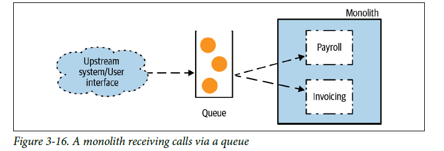

# **Strangler Fig**
<div align="center">

[](https://github.com/MasterCloudApps-Projects/Monolith-to-Microservices-Examples/tree/master/Strangler_Fig/README.md)
[](https://github.com/MasterCloudApps-Projects/Monolith-to-Microservices-Examples/tree/master/Strangler_Fig/README.es.md)
</div>

The ``Strangler Fig`` pattern consists of the incremental and gradual migration of the specific functionalities located within the monolith to independent microservices.

The pattern is divided into 3 steps:
1. Monolithic application. Requests and functionalities are answered within it.
2. Implementation of the functionality in a new microservice.
3. With your new implementation ready, we can migrate the requests from the monolith to the microservice.

<div align="center">


</div>

We are going to apply the pattern in different examples with the three steps explained above.

<br>

## **Example 1. Separate functionality extraction**
____________________________________________________________

In order to perform the migration of requests and hot deployments, we must configure a reverse proxy. The host of our application will be: `payment.service`.

To do this, we must add:
- Linux: `/etc/hosts`
- Windows: `C:/Windows/System32/drivers/etc/hosts`

The following line: `127.0.0.1 payment.service`

We start from a monolith that contains all the logic of the application. The need arises to extract a separate functionality, in this case `Inventory`, to a new microservice.

Below is an image of the initial and final state of the application after applying the pattern.

<div align="center">


</div>

### **Step 1**
We have our monolith application. Requests and functionalities are answered within it.
```
> docker-compose -f Ejemplo_1/1_docker-compose-monolith.yml up --build --force-recreate

> docker-compose -f Ejemplo_1/1_docker-compose-proxy.yml up -d
```
----
NOTE:
   
``--build``: build images before starting containers.

``-d, --detach``: Detached mode: Run containers in the background, print new container names.

``--force-recreate``    Recreate containers even if their configuration
                        and image haven't changed.

----

Our proxy is configured to direct all requests to the existing monolith.

```
server {
  listen 80;
  server_name payment.service;

  location ~ ^/ {
    proxy_pass http://1-strangler-fig-monolith:8080;
  }
}
```

We can test our monolith through a request to:
```
> curl payment.service/inventory
```

### **Step 2**
We must implement the functionality in a new microservice.
```
> docker-compose -f Ejemplo_1/2_docker-compose-ms.yml up --build --force-recreate
```

Requests keep coming to our monolith, but we can test our microservice by calling it directly:
```
> curl localhost:8081/inventory
```

We see that the responses come with the tag ``[MS]`` that we have added in the data initializer.

### **Step 3**
With your new implementation ready, we proceed to redirect calls from the monolith to the new microservice.

```
> docker-compose -f  Ejemplo_1/3_docker-compose-proxy.yml up -d
```

The new proxy settings are:
```
server {
  listen 80;
  server_name payment.service;

  location ~ ^/(?!(inventory)) {
    proxy_pass http://1-strangler-fig-monolith:8080;
  }

  location /inventory {
    proxy_pass http://2-strangler-fig-inventory-ms:8081;
  }
}
```

Let's try to make requests:
```
> curl payment.service/inventory
```

From now on, the response will have a `[MS]` prefix that we have added to the sample data automatically registered in the microservice.

In case of any problem, you can always do a rollback and redirect the requests back to the monolith.

```
> docker-compose -f  Ejemplo_1/1_docker-compose-proxy.yml up -d
```

<br>

## **Example 2. Internal functionality extraction**
____________________________________________________________

If we want to apply the pattern on `Payroll`, which uses an internal functionality (`User notification`) in the monolith, we must expose that internal functionality to the outside through an endpoint.

<div align="center">


</div>

How does this fit into our 3 steps?:

1. In case of not having a proxy, we must add one that allows directing the requests.
2. With the proxy active, we perform the extraction to our microservice. It could be done in several steps:
    - Creation of the empty microservice, without functionality returning `501 Not Implemented`. It is recommended to take it to production to familiarize ourselves with the deployment process.
    - Implementation of the microservice functionality.
3. We move requests from the monolith to the microservice progressively. If there is an error we can redirect the requests back to the monolith.

<div align="center">


</div>

### **Step 1**
We have our monolith application, requests and functionalities are answered within it.

```
> docker-compose -f Ejemplo_2/1_docker-compose-monolith.yml up --build

> docker-compose -f Ejemplo_2/1_docker-compose-proxy.yml up -d
```

We can test our monolith:
```
> curl -v -H "Content-Type: application/json" -d '{"shipTo":"Juablaz","total":120}' payment.service/payroll
```

Logs in the notification:
```
Payroll 3 shipped to Juablaz of 120.0
```

### **Step 2**
We must implement the functionality in a new microservice that will communicate with the monolith. Therefore, the monolith must expose an endpoint for the microservice to connect through it `/notification`.
We released a version of the monolith (`v2`) and our new microservice.

```
> docker-compose -f Ejemplo_2/2_docker-compose.yml up --build
```

We can test our microservice:

```
> curl -v -H "Content-Type: application/json" -d '{"shipTo":"Juablaz","total":220}' localhost:8081/payroll
```

The notification is logged in the new monolith (`v2`), therefore the communication is correct:
```
Payroll 3 shipped to Juablaz of 220.0
```

Requests through the proxy `payment.service` continue to reach the old monolith, but we have tested the correct operation of the new monolith and the microservice.


### **Step 3**
With the new implementation ready, we redirected requests to the `Payroll` functionality monolith.

```
> docker-compose -f  Ejemplo_2/3_docker-compose-proxy.yml up -d
```

The new configuration is:
```
server {
  listen 80;
  server_name payment.service;

  location ~ ^/(?!(payroll)) {
    proxy_pass http://2-strangler-fig-monolith:8082;
  }

  location /payroll {
    proxy_pass http://2-strangler-fig-payroll-ms:8081;
  }
}
```

We can test our application:
```
> curl -v -H "Content-Type: application/json" -d '{"shipTo":"Juablaz","total":320}' payment.service/payroll
```

The notification is logged in the monolith `v2`:
```
Payroll 3 shipped to Juablaz of 320.0
```

At this point we can consider removing version 1 of the monolith:

```
> docker-compose -f  Ejemplo_2/1_docker-compose_monolith.yml down
```

What happens if we have had a problem in the new version?
We can quickly load the old proxy settings:

```
> docker-compose -f Ejemplo_2/1_docker-compose-proxy.yml up -d
```

In this way, the petitions go back to the old monolith.

<br>

## **Example 3. Interception of messages**
____________________________________________________________
In this example we have not added a proxy to redirect requests since the pattern is not based on intercepting HTTP requests. It is focused on intercepting and redirecting messages from the messaging queue.

### **Step 1**
We have a monolith that receives messages through a queue.
To do this, we have also created a `strangler_fig_producer` message producer and configured a Kafka-based queuing system.
It consists of two topics: `invoicing-v1-topic` and` payroll-v1-topic`.

<div align="center">


</div>

```
> docker-compose -f  Ejemplo_3/1_docker-compose.yml up --build

> docker-compose -f  Ejemplo_3/1_docker-compose-producer.yml up -d 
```

Let's do a test through a request:
```
> curl -v -H "Content-Type: application/json" -d '{"shipTo":"Juablaz","total":220}' localhost:9090/messages/send-payroll
```

We can see how to log in to our monolith:
```
> Payroll 3 shipped to Juablaz of 220.0
```

We have two possible casuistry:
- We can change the code of the monolith.
- We can't change the code on the monolith.

## **a) We can change the code of the monolith**
### **Step 2**

<div align="center">


</div>

We have to modify the monolith code to ignore the `Payroll` requests. You will no longer have the `payroll-v1-topic` configured from which you were receiving messages. Also, we need to expose the `Notification` endpoint on the monolith to be able to send notifications from the microservice. Therefore, we need a `v2` version of the monolith.

The complication arises if we need to perform a hot deployment, without a service stop.
- For this we need to create new topics to which we write from the `producer` and to which we connect from the` monolith-v2`. We cannot continue writing in the same topic that was used in version 1. In this case we are changing the source of information and it is possible that depending on the situation we cannot change it.

------
NOTE:
We have configured our kafka to automatically create topics if it cannot find them, `KAFKA_AUTO_CREATE_TOPICS_ENABLE`, if this configuration is not enabled it would be necessary to connect to the docker container and execute a command.

It would be done:

```
> docker exec -it $(docker ps -aqf "name=ejemplo_3_kafka_1") bin/kafka-topics.sh --create --zookeeper zookeeper:2181 --replication-factor 1 --partitions 1 --topic payroll-v2-topic

> docker exec -it $(docker ps -aqf "name=ejemplo_3_kafka_1") bin/kafka-topics.sh --create --zookeeper zookeeper:2181 --replication-factor 1 --partitions 1 --topic invoicing-v2-topic
```
------

We are going to run the example following the pattern, first the implementation and then migrating the "requests", in this case the messages on the queue:
```
> docker-compose -f  Ejemplo_3/2_a_docker-compose.yml up --build
```

We can test our new implementation of the monolith:
```
> curl -v localhost:8082/payroll
```

### **Step 3**
We are going to migrate the "requests", in this case, migrate the messages to new topics where to write:
```
> docker-compose -f  Ejemplo_3/3_a_docker-compose-producer.yml up -d --build
```

Let's test if it works correctly:
```
> curl -v -H "Content-Type: application/json" -d '{"shipTo":"Juablaz","total":220}' localhost:9090/messages/send-payroll
```

This logs in our monolith `v2`:
```
> Payroll 3 shipped to Juablaz of 220.0
```

We can confirm it by requesting the microservice:
````
> curl localhost:8081/payroll/3
````

In case of error, we can change the data writing to the old monolith:
```
> docker-compose -f  Ejemplo_3/1_docker-compose-producer.yml up -d
```

## **We can't change the code of the monolith**
### **Step 2**


In this case we cannot touch the monolith. We only need `Invoicing` messages to reach the monolith because we cannot unprocess those that arrive at` Payroll`. We cannot log notifications from the microservice because we would have to expose an endpoint as we have done in the previous example.
We are going to log the Payroll creation into the microservice itself to simplify the example.

We have created the following flow:
- A POST request arrives at `strangler-fig-producer`.
- It generates a message to the Kafka queue to the two possible topics `invoicing-all-msg-topic`,` payroll-all-msg-topic`
- We have a content-based routing microservice `strangler-fig-cbr` that consumes and redirects topics:
    - `payroll-v1-topic` - Monolith
    - `payroll-v2-topic` - Payroll
- The `payroll-v1-topic` topic would be unused since we are going to redirect the messages to the` v2-topic`.

If we need to perform a hot deployment without service stop, as we have explained in the previous example, we need to create new topics to which we write from the `producer` and to which we connect from the` cbr`. We cannot continue writing in the same topic that was used in version 1. In this case we are changing the source of information and it is possible that depending on the situation we cannot change it.

We launched a version exactly the same as the previous one of the monolith, changing the topics to which it subscribes.

```
> docker-compose -f  Ejemplo_3/2_b_docker-compose.yml up --build
```

We can test our new implementation of the microservice and cbr:
```
> curl -v localhost:8081/payroll
```

At this time, requests keep coming to the old topic, `payroll-v1-topic` and` invoicing-v1-topic`.


### **Step 3**
We are going to migrate the "requests". In this case, we migrate the messages to new topics where to write:
```
> docker-compose -f  Ejemplo_3/3_b_docker-compose-producer.yml up -d
```

Let's test that it works correctly:
```
> curl -v -H "Content-Type: application/json" -d '{"shipTo":"Juablaz","total":220}' localhost:9090/messages/send-payroll
```

Log in to our microservice (Remember that the request is not made from the microservice to the monolith to log in since we cannot change the monolith code):
```
> Payroll 3 shipped to Juablaz of 220.0
```

In case of error, we can change the data writing to the old monolith:
```
> docker-compose -f  Ejemplo_3/1_docker-compose-producer.yml up -d
```

# Links of interest:
> https://github.com/javieraviles/split-the-monolith

> https://www.it-swarm-es.com/es/nginx/docker-nginx-proxy-como-enrutar-el-trafico-un-contenedor-diferente-utilizando-la-ruta-y-no-el-nombre-de-host/828289465/

> https://refactorizando.com/kafka-spring-boot-parte-uno/

> https://github.com/flipkart-incubator/kafka-filtering#:~:text=Kafka%20doesn't%20support%20filtering,deserialized%20%26%20make%20such%20a%20decision.


# Commands of interest:
Delete all containers using the following command:
> docker rm -f $(docker ps -a -q)

